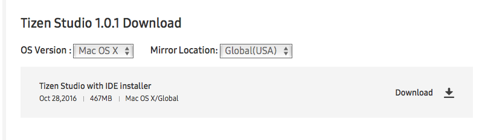

<a id="samsungtizenusage-top"> </a>

# Usage
##  How to integerate NexPlayer Tizen SDK 

This document describes the integration of the NexPlayer Tizen SDK and the detailed steps
to create a sample application.


## Prerequisites 

### Setting Environment

1. Download and Install the Tizen Studio IDE from this [link](http://developer.samsung.com/tv/develop/tools/tizen-studio/). Make sure to select the appropriate Operating System 


2. Install the Tizen TV SDK from [here]( http://developer.samsung.com/tv/develop/tools/tv-extension/download).


3. Configure the Tizen TV Emulator. Go to Tools-->Emulator Manager. Click on Create button and follow the instructions in the screen. The default settings can be keept.


4. The Tizen certification is required to run a package on the Emulator or on a real-device. Click on Tools-->Package Manager to obtain it.
Follow [this](https://docs.tizen.org/application/vstools/tools/certificate-manager/) guide to see all the steps.

------

## How to create a simple Tizen TV application using NexPlayer Tizen SDK

### Create a Basic Project using Tizen Studio

1. Create a new project Click on File -> New -> Tizen Project. 


2. Select the type of the project.  


3. Now select web aplication.  


4. To finish select basic project.  


4. Open the next index.  


5. And you can use the following code.
```html
  <!DOCTYPE html>
<html>
<head> 
    <!-- MANDATORY! LOAD JQUERY BY CDN OR LOCAL  -->
    <meta charset="UTF-8">
    <meta name="viewport" content="width=device-width, initial-scale=1.0, maximum-scale=1.0, user-scalable=no" />
    <title>NexPlayer</title>
    <style type="text/css">
        #player_container {
            width: 90%;
            margin: auto;
            padding-top: 50.625%; /* 16:9 Aspect Ratio 56.25 * 0.9 */
            position: relative;
        }
        @media (min-width: 75rem) {
            #player_container {
                width: 50%;
                padding-top: 28.125%; /* 16:9 Aspect Ratio 56.25 * 0.5 */
            }            
        }
        h1 {
            text-align: center;
        }
        #player {
            background-color: black;
            position: absolute;
            top: 0px;
            width: 100%;
            height: 100%;
        }
        #warning {
            background-color: red;
            text-align: center;
            display: none;
        }
    </style>
</head>
<body style="background:white">
    <h1>NexPlayer for Tizen WebApps</h1>
    <div id="player_container">
        <div id="player"></div>
    </div>
    <!-- MANDATORY! LOAD NEXPLAYER WITH THE TAG "DEFER" -->
    <script src="NEXPLAYER LIB" defer></script>
    <script type="text/javascript">
    window.addEventListener('load', function() {
        nexplayer.Setup({
            key: "YOUR KEY",
            div: document.getElementById('player'),
            src: 'https://dash.akamaized.net/akamai/bbb_30fps/bbb_30fps.mpd',
        });
})
    </script>
</body>
</html>
```

### Building and Running the Project

To launch the project on Tizen TV Check [this](https://developer.samsung.com/smarttv/develop/getting-started/using-sdk/tv-device.html)
 guide.

To launch the project on Smart TV Emulator Check [this](https://developer.samsung.com/smarttv/develop/getting-started/using-sdk/tv-emulator.html)
 guide.
