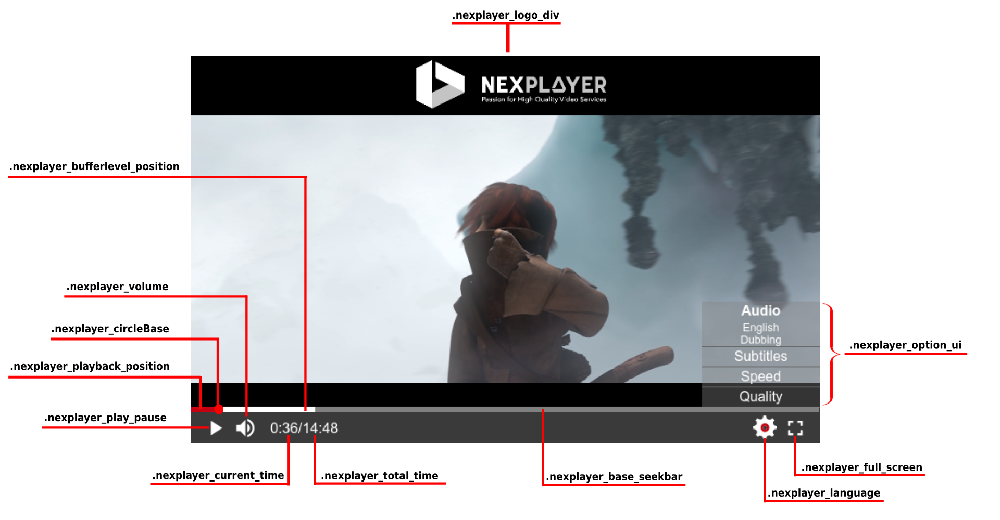

<a id="advance-top"> </a>

# Advance Usage

NexPlayer™ offers more advanced options to control the playback. This section contains several examples of how to use these features.

## Security

Digital rights management (DRM) is a set of access control technologies for restricting the use of proprietary hardware and copyrighted works.

<div class="alert alert-success hints-alert"><div class="hints-icon"><i class="fa fa-mortar-board"></i></div><div class="hints-container"><p>Most of the DRMs available won't work without using HTTPS with a certificate. For development purposes, a tool like <a style ="color:#5A5A5A!important" href="https://ngrok.com/" target="_blank">ngrok</a> can be used to test DRM-protected links.</p>
</div></div>

NexPlayer™ supports several DRM technologies:

<table class="table table-sm">
<style> .titles{color: #ffffff; width: 250px;}</style>
  <tbody>
    <tr>
      <th class="titles" bgcolor="#C80000" scope="row">MODELS </th>   
      <th class="titles" bgcolor="#C80000" scope="row">DASH+PlayReady</th>        
      <th class="titles" bgcolor="#C80000" scope="row">DASH+Widevine</th>        
      <th class="titles" bgcolor="#C80000" scope="row">HLS+Widevine</th>        
    </tr>
    <tr>
      <th  scope="row">Samsung(Tizen)2017-2018+Models</th>      
      <th  scope="row"><span style="color: transparent;  text-shadow: 0 0 0 rgb(42, 170, 82); font-weight:100; font-size:25px; ">&#x2714;</span> </th>      
      <th  scope="row"><span style="color: transparent;  text-shadow: 0 0 0 rgb(42, 170, 82); font-weight:100; font-size:25px; ">&#x2714;</span> </th>      
      <th  scope="row"><span style="color: transparent;  text-shadow: 0 0 0 rgb(42, 170, 82); font-weight:100; font-size:25px;">&#x2714;</span></th>      
    </tr>
    <tr>
       <th  scope="row">Samsung(Tizen)2015-2016MODELS</th>      
      <th  scope="row">&#10060</th>      
      <th  scope="row"><span style="color: transparent;  text-shadow: 0 0 0 rgb(49, 112, 143); font-weight:110; font-size:30px;">&#8505;</span> </th>      
      <th  scope="row"><span style="color: transparent;  text-shadow: 0 0 0 rgb(49, 112, 143); font-weight: 900; font-weight:110; font-size:30px;">&#8505;</span></th>      
    </tr>
    <tr>
      <th  scope="row">LG WebOS 4.0+</th>      
      <th  scope="row"><span style="color: transparent;  text-shadow: 0 0 0 rgb(42, 170, 82); font-weight:100; font-size:25px;">&#x2714;</span></th>      
      <th  scope="row"><span style="color: transparent;  text-shadow: 0 0 0 rgb(42, 170, 82); font-weight:100; font-size:25px;">&#x2714;</span> </th>      
      <th  scope="row"><span style="color: transparent;  text-shadow: 0 0 0 rgb(42, 170, 82); font-weight:100; font-size:25px;">&#x2714;</span></th>             
    </tr>

  </tbody>


</table>

<div class="alert alert-info hints-alert"><div class="hints-icon"><i class="fa fa-info-circle"></i></div><div class="hints-container">
<p>  
*Widevine Classic was supported in these models, but ​it has been deprecated by Google. Itis no longer supported on Samsung TVs due to maintenance issues  
</p>
</div></div>


<style> .titles{color: #ffffff; width: 250px;}</style>

<table class="table table-sm">

  <tbody>
    <tr>
      <th class="titles" bgcolor="#C80000" scope="row">FEATURE </th>   
      <th class="titles" bgcolor="#C80000" scope="row">AES 128</th>        
      <th class="titles" bgcolor="#C80000" scope="row">PLAYREADY</th>        
      <th class="titles" bgcolor="#C80000" scope="row">WIDEVINE</th>        
    </tr>
    <tr>
      <th  scope="row">Encrypted key </th>      
      <th  scope="row">&#10060</th>      
      <th  scope="row"><span style="color: transparent;  text-shadow: 0 0 0 rgb(42, 170, 82); font-weight:100; font-size:25px;">&#x2714;</span> </th>      
      <th  scope="row"><span style="color: transparent;  text-shadow: 0 0 0 rgb(42, 170, 82); font-weight:100; font-size:25px;">&#x2714;</span></th>      
    </tr>
    <tr>
       <th  scope="row">Separate encryption key server </th>      
      <th  scope="row">&#10060</th>      
      <th  scope="row"><span style="color: transparent;  text-shadow: 0 0 0 rgb(42, 170, 82); font-weight:100; font-size:25px;">&#x2714;</span> </th>      
      <th  scope="row"><span style="color: transparent;  text-shadow: 0 0 0 rgb(42, 170, 82); font-weight:100; font-size:25px;">&#x2714;</span></th>      
    </tr>
    <tr>
      <th  scope="row">Hardware DRM </th>      
      <th  scope="row"><span style="color: transparent;  text-shadow: 0 0 0 rgb(42, 170, 82); font-weight:100; font-size:25px;">&#x2714;</span></th>      
      <th  scope="row"><span style="color: transparent;  text-shadow: 0 0 0 rgb(42, 170, 82); font-weight:100; font-size:25px;">&#x2714;</span> </th>      
      <th  scope="row"><span style="color: transparent;  text-shadow: 0 0 0 rgb(42, 170, 82); font-weight:100; font-size:25px;">&#x2714;</span></th>             
    </tr>
    <tr>
      <th  scope="row">Custom Headers</th>      
      <th  scope="row"><span style="color: transparent;  text-shadow: 0 0 0 rgb(42, 170, 82); font-weight:100; font-size:25px;">&#x2714;</span></th>      
      <th  scope="row"><span style="color: transparent;  text-shadow: 0 0 0 rgb(42, 170, 82); font-weight:100; font-size:25px;">&#x2714;</span> </th>      
      <th  scope="row"><span style="color: transparent;  text-shadow: 0 0 0 rgb(42, 170, 82); font-weight:100; font-size:25px;">&#x2714;</span></th>      
    </tr>

  </tbody>


</table>

<div class="alert alert-info hints-alert"><div class="hints-icon"><i class="fa fa-info-circle"></i></div><div class="hints-container">
<p>
*For Tizen, DRM is supported from 2017 device models and higher<br>    
*For WebOS, DRM is supported from WebOS 4.0 and higher  
</p>
</div></div>


### Widevine
A DRM powered by <a href =https://www.widevine.com target="_blank">Google</a>. It can be set by entering the information into the DRM array:

```js
var nexDRMInformationWidevine = {
  NexDRMType:'com.widevine.alpha',
  NexDRMKey: 'DRM key URL',
  NexHeaders:[{FieldName: 'Optional field name', //Optional
               FiledValue: 'Optional field value'}] //Optional
};
nexplayer.Setup({
  key: 'REPLACE THIS WITH YOUR CUSTOMER KEY',
    div: document.getElementById('player'),
    src: 'VIDEO URL',
    drm: [nexDRMInformationWidevine]
});

```

<div class="alert alert-info hints-alert"><div class="hints-icon"><i class="fa fa-info-circle"></i></div><div class="hints-container"><p>
Please note that the HTTP headers (NexHeaders) are optional, and might depend on the implementation of the Widevine server used. </p>
</div></div>

### Playready

A DRM powered by <a href =https://www.microsoft.com/playready/ target="_blank">Microsoft</a>. It can be used by entering the information into the DRM array:

```js
var nexDRMInformationPlayReady = {
NexDRMType:'com.microsoft.playready',
 NexDRMKey: 'DRM key URL',
NexHeaders:[{FieldName: 'Optional field name',  //Optional
            FiledValue: 'Optional field value'}]}; //Optional

nexplayer.Setup({
  key: 'REPLACE THIS WITH YOUR CUSTOMER KEY',
    div: document.getElementById('player'),
    src: 'VIDEO URL',
    drm: [nexDRMInformationPlayReady]
});
```

<div class="alert alert-info hints-alert"><div class="hints-icon"><i class="fa fa-info-circle"></i></div><div class="hints-container"><p>
Please note that the HTTP headers (NexHeaders) are optional, and might depend on the implementation of the PlayReady server used.</p>
</div></div>


### CENC

The Common Encryption Scheme (CENC) specifies the standard to enable decryption of the same file using different DRM systems. It allows the same CENC-encrypted content to be decrypted and played by any client device that interfaces with a DRM system that can serve the associated CENC key information.

For example, Widevine and PlayReady can be used with the same DASH manifest and chunk files:

```js
// Widevine
var nexDRMInformationWidevine = {NexDRMType:'com.widevine.alpha',
 NexDRMKey: 'DRM key URL',
            NexHeaders:[{FieldName: 'Optional field name',  //Optional
            FiledValue: 'Optional field value'}]}; //Optional

// PlayReady
var nexDRMInformationPlayReady = {NexDRMType:'com.microsoft.playready',
 NexDRMKey: 'DRM key URL',
            NexHeaders:[{FieldName: 'Optional field name', //Optional
            FiledValue: 'Optional field value'}]}; //Optional

nexplayer.Setup({
  key: 'REPLACE THIS WITH YOUR CUSTOMER KEY',
    div: document.getElementById('player'),
    src: 'VIDEO URL',
    drm: [nexDRMInformationWidevine, nexDRMInformationPlayReady]
});

```

### AES

NexPlayer™ supports HLS content encrypted with the AES-128 algorithm. If the key is transported inside the HLS manifest itself, it will automatically work without any modification on the developer's side.

<div class="alert alert-info hints-alert"><div class="hints-icon"><i class="fa fa-info-circle"></i></div><div class="hints-container"><p>
Please note that this method is not as secure as other DRMs.</p>
</div></div>


AES is supported with HLS
### Custom Headers
Custom headers can be included in each HTTP petition, even without the use of DRM, to include extra information for the server.

This information can be passed in the DRM array:

```js
drmCustomHeaders = {NexHeaders:[{FieldName: 'Optional field name', FiledValue: 'Optional field value'}]};

nexplayer.Setup({
  key: 'REPLACE THIS WITH YOUR CUSTOMER KEY',
    div: document.getElementById('player'),
    src: 'VIDEO URL',
    drm: [drmCustomHeaders]
});
```
<div class="alert alert-info hints-alert"><div class="hints-icon"><i class="fa fa-info-circle"></i></div><div class="hints-container"><p>
Please note that this method is not as secure as other DRMs.</p>
</div></div>

Custom headers are supported with HLS and DASH.

### Coming from AVPlay

If you are migrating from AVPlay to our player, in order to configurate the DRM header, it could be helpful to take a look at this information.

The way to introduce a header in AVPlay is like the following example (different way from our player):

```js
DRM_NAME: {
    name: 'DRM NAME',
    url:  'REPLACE THIS WITH YOUR MEDIA URL',
    licenseServer: 'REPLACE THIS WITH YOUR LICENSE SERVER URL',
    customData: 'REPLACE THIS WITH YOUR CUSTOM DATA'
};
```

To enter the same configuration in our player it should be done like this (PlayReady used as example):

```js
var nexDRMInformationPlayReady = {
    NexDRMType: 'DRM NAME (e.g. com.microsoft.playready)',     
    NexDRMKey: 'REPLACE THIS WITH YOUR LICENSE SERVER URL',
    NexHeaders:[{FieldName: 'X-AxDRM-Message' FiledValue:',REPLACE THIS WITH YOUR CUSTOM DATA,'}]
};
src:  'REPLACE THIS WITH YOUR MEDIA URL',
```

FieldName should be specified (if you don’t know this field, please enter 'X-AxDRM-Message') and as FiledValue should be included the wanted custom data.


## Ads

NexPlayer supports the VAST, VPAID, and VMAP ad formats.

You can insert any pre/mid/post roll ad by setting up the ad links as shown below:
```js
nexplayer.Setup({
  key: 'REPLACE THIS WITH YOUR CUSTOMER KEY',
    div: document.getElementById('player'),
    src: 'VIDEO URL',
    vast: 'VAST / VPAID / VMAP link'
});
```
Sample VAST links can be found on the <a href =https://developers.google.com/interactive-media-ads/docs/sdks/html5/tags target="_blank">Google Website</a>.


## Mute

This feature tells the player whether to start playback with the volume muted or not. This can be configured in the player by adding the <b>mutedAtStart</b> option:
```js
{
  div: document.getElementById('player'), // Mandatory
  src: 'URL video', // Mandatory
  mutedAtStart: true
}
```
<div class="alert alert-info hints-alert"><div class="hints-icon"><i class="fa fa-info-circle"></i></div><div class="hints-container"><p>Please note that the default value of the <b>mutedAtStart</b> parameter is false, so the player will start unmuted if <b>mutedAtStart</b> is not set to true.</p>
</div></div>


## Autoplay

This feature enables/disables autoplay. This can be configured in the player by adding the <b>autoplay</b> option:

```js
{
  div: document.getElementById('player'), // Mandatory
  src: 'URL video', // Mandatory
  autoplay: false
}
```

<div class="alert alert-info hints-alert"><div class="hints-icon"><i class="fa fa-info-circle"></i></div><div class="hints-container"><p>Please note that the default value of the <b>autoplay</b> parameter is true, so the player will star without any user action. </p>
</div></div>


## ID3 Tags

NexPlayer™ supports timed metadata for HLS and DASH content. The information is available in the <a href="https://developer.mozilla.org/en-US/docs/Web/API/TextTrack" target="_blank">TextTrack </a> array of the video element.
```js
var callBackWithPlayers = function (nexplayerInstance, videoElement) {
  videoElement.addEventListener('loadedmetadata', function(event) {
    if (videoElement.textTracks) showTimedMetadata(videoElement);
  });
};

nexplayer.Setup({
  key: 'REPLACE THIS WITH YOUR CUSTOMER KEY',
  div: document.getElementById('player'),
  src: 'VIDEO URL',
  callbacksForPlayer: callBackWithPlayers
});

var showTimedMetadata = function(videoElement) {
  videoElement.textTracks[1].addEventListener('cuechange', function (cueChangeEvent) {
    var activeCues = cueChangeEvent.currentTarget.activeCues[0];
      if (activeCues) console.log(activeCues['value']['data']);
  });
};
```
## Access to the player instances

An instance of the player and the video element will be accessible once NexPlayer™ is configured and loaded. The 'callbacksForPlayer' option should be set. The defined function will be called when the player is considered ready. Once the callback is received, the playback can be controlled with the NexPlayer™ instance and the associated video element.

```js
var callBackWithPlayers = function (nexplayerInstance, videoElement) {
  // Eg. seeking to 30 sec from outside the predefined UI could be done like this
  nexplayerInstance.seek(30);
}

nexplayer.Setup({
  key: 'REPLACE THIS WITH YOUR CUSTOMER KEY',
  div: document.getElementById('player'),
  src: 'VIDEO URL',
  callbacksForPlayer: callBackWithPlayers
});

```
<div class="alert alert-success hints-alert"><div class="hints-icon"><i class="fa fa-mortar-board"></i></div><div class="hints-container"><p>We strongly recommend calling the APIs after the player is ready.</p>
</div></div>


## CSS Customization




### Introduction

This document provides an explanation of the UI and all the related CSS classes that can be modified to customize the default UI of the player.

### CSS Classes

| CSS Class | Description |
| --- | --- |
| .nexplayer_play_pause | Customize the play/pause button |
| .nexplayer_volume | Customize the volume button |
| .nexplayer_current_time | Customize the play/pause button |
| .nexplayer_title | Customize the title text |
| .nexplayer_language	 | Customize the full screen button |
| .nexplayer_full_screen | Customize the play/pause button |
| .nexplayer_total_time | Customize the total time text |
| .nexplayer_option_ui | Customize the language options menu |
| .nexplayer_logo_div | Customize the logo watermark |
| .nexplayer_playback_position | Customize the already played part of the seekbar |
| .nexplayer_bufferlevel_position | Customize the buffered part of the seekbar |
| .nexplayer_base_seekbar | Customize the default part of the seekbar |
| .nexplayer_circleBase | Customize the current postion marker of the seekbar |  

Please take into account that the seekbar and the volume control bar are the same component. So if you modify the .nexplayer_playback_position, .nexplayer_bufferlevel_position, .nexplayer_base_seekbar, or .nexplayer_circleBase css classes, then the volume control bar will change accordingly.

<div class="alert alert-success hints-alert"><div class="hints-icon"><i class="fa fa-mortar-board"></i></div><div class="hints-container"><p>Please note that to overwrite the styles, the JavaScript file should be imported before the desired customizations.</p>
</div></div>

### Responsive Configuration

The size of the UI adapts according to the size of the player. There are three different css classes that control this behavior:

| CSS Class | Description |
| --- | --- |
| .nexplayer_container | Main container |
| .nexplayer_container_normal | Standard size of the player > 768px |
| .nexplayer_container_mobile | Mobile size of the player > 461px |
| .nexplayer_container_tiny | Tiny size of the player < 461px |

Modifying the .nexplayer_container class will bring the changes to every platform. In order to customize individual or more platforms in a different way, the .nexplayer_container class should be followed by the desired platform class:

```
.nexplayer_container .nexplayer_container_normal <class to modify>

.nexplayer_container .nexplayer_container_mobile <class to modify>

.nexplayer_container .nexplayer_container_tiny <class to modify>

```

### Font

The font of the player can be customized using the following code:

```css
.nexplayer_container {
    font-size: 20pt;
    color: blue;
    font-family: sans-serif;
}

```

### Overwriting Styles

To overwrite the CSS styles of the default UI, the correct container name has to be added:

#### Button

```css
.nexplayer_container .nexplayer_container_normal .nexplayer_play_pause {
    background-color: yellow;
}

.nexplayer_container .nexplayer_container_mobile .nexplayer_play_pause {
    background-color: blue;
}

.nexplayer_container .nexplayer_container_tiny .nexplayer_play_pause {
    background-color: red;
}

```

#### Seekbar

```css
.nexplayer_container .nexplayer_circleBase {
    background-color: white;
}

.nexplayer_container .nexplayer_base_seekbar {
    background-color: blue;
}

.nexplayer_container .nexplayer_bufferlevel_position {
    background-color: yellow;
}

.nexplayer_container .nexplayer_playback_position {
    background-color: red;
}

```

### Modify the Selected Language Style

To customize the selected language style on the .nexplayer_option_ui menu, the following code should be used:

```css
.nexplayer_container .nexplayer_option_ui .nexplayer_selected_element {
    color: green;
}
```

### Control Bar Style

To customize the bottom control bar:

```css
.nexplayer_container .nexplayer_bar {
    background-color: green;
}

```

### Icon Changing

In order to change the default icons of the player, the following code should be used:

```css
.nexplayer_container .nexplayer_IconPause {
    background-image: url(replay.svg) !important;
}
```

Please note that we recommend using SVG icons. The list of all the CSS classes that defines the icons is:

| CSS Class | Description |
| --- | --- |
| .nexplayer_IconPlay | Play icon |
| .nexplayer_IconPause | Pause icon |
| .nexplayer_IconReset | Reset icon |
| .nexplayer_IconVolume | Volume icon |
| .nexplayer_IconMuted | Muted volume icon |
| .nexplayer_IconFullscreen | Full screen icon |
| .nexplayer_IconExitFullscreen	 | Exit full screen icon |
| .nexplayer_IconLanguage | Language options icon |
| .nexplayer_IconTriangle | The triangle below the .nexplayer_option_ui |

### Hover Effect Icons

Any icon has a predefined effect when the user hovers the mouse over or touches an icon.

This behavior can be customized with the hover selector on the .nexplayer_icon CSS class:

```css
.nexplayer_container .nexplayer_icon:hover {
    filter: drop-shadow(8px 8px 8px red);
}
```

## Custom Actions

Advanced actions can be performed with a player instance. For the full action list, check <a href="#/API" target="_blank">NexPlayer API</a>

### ABR

HLS and DASH streams contain several video bitrates in order to adjust the quality based on the network conditions. Changes in bitrate are done automatically when ABR (Adaptive Bitrate) is enabled (default behavior).

The currently selected track can be obtained with the method <code>getCurrentTrack</code>of NexPlayer™. It returns all the track information.

```js
nexplayerInstance.getCurrentTrack();
```
All the available tracks can be obtained with the method <code>getTracks </code> of NexPlayer™.

```js
nexplayerInstance.getTracks();
```

Setting a fixed track can be achieved by calling the method <code>setTrack</code> of NexPlayer™.

```js
// Sets the first track as the used one
nexplayerInstance.setTrack(nexplayerInstance.getTracks()[0].id);
```

A change in the current track can be detected with the NexPlayer™ <a href="#/advanceusage?id=callbacks" >callbacks</a>.

### Subtitles


Information about the available subtitles can be retrieved with the <code>textTracks</code> attribute of the video element.
```js
videoElement.textTracks;
```

The active subtitles mode is set to <code>showing</code>. The currently selected subtitle can also be selected by setting the mode to showing. A subtitle can be deselected by setting the mode to <code>hidden</code>.
```js
videoElement.textTracks[0].mode = "showing"; //0 -> the id of the textTrack
```

##### SRT Subtitles

NexPlayer supports the SRT subtitle format. You can insert an external SRT file by setting up the SRT source link and the language as shown below:

```js
nexplayer.Setup({
    key: 'REPLACE THIS WITH YOUR CUSTOMER KEY',
    div: document.getElementById('player'),
    src: 'VIDEO URL',
    callbacksForPlayer: callBackWithPlayers
    srtSubtitles: ['http://webs.nexstreaming.com/pd/function_local/Function_SRT_AOA_MV_H264_1920x1080_HP_2999K_24F_AAC_LC_5m26s.srt','en']
});

```


<div class="alert alert-info hints-alert"><div class="hints-icon"><i class="fa fa-info-circle"></i></div><div class="hints-container"><p>
Please note that the first parameter is the source link and the second the language that will be displayed in the subtitles label. </p>
</div></div>

NexPlayer also supports adding SRT subtitles in runtime. Call <code>addSrtSubtitles</code> if you want to add a srt subtitle:

```js
nexplayerInstance.addSrtSubtitles(['source.srt', 'srclang']);
```


### Audio

Information about the current audio can be retrieved with the method <code>getCurrentAudioStream</code> of NexPlayer™. It returns all the audio information for that stream.

```js
nexplayerInstance.getCurrentAudioStream();
```

All the available audio tracks can be retrieved with the method <code>getAudioStreams</code> of NexPlayer™.

```js
nexplayerInstance.getAudioStreams();
```

The currently used audio stream can be set with the method <code>setAudioStream</code> of NexPlayer™, passing one of the IDs of <code>getAudioStreams</code>.

```js
// Sets the first audio stream as the used one
nexplayerInstance.setAudioStream(nexplayerInstance.getAudioStreams()[0].id);
```

### Seek

Seeking to a certain time can be achieved by calling the method <code>seek</code> of the NexPlayer™ and passing the desired number of seconds.

```js
nexplayerInstance.seek(30);
```

### Picture in Picture

Only supported by Tizen 4.0 (2018) or newer versions

```js
var callBackWithPlayers = function (nexplayerInstance, videoElement) {
    videoElement.requestPictureInPicture();
  };

  nexplayer.Setup({
    key: 'REPLACE THIS WITH YOUR CUSTOMER KEY',
    div: document.getElementById('player'),
    src: 'VIDEO URL',
    callbacksForPlayer: callBackWithPlayers
  });

```


## Callbacks

References to the <a href="#/advanceusage?id=access-to-the-player-instances">player instances</a> are needed to register callbacks.
There are two types of emitted events that can be listened to.


### Video Element Events

The video element emits the basic event, such as a change of the state of the video (pause/play/buffering), or informs that the current time of the video has changed.

The method <code>addEventListener</code> of the video element needs to be called with any of the available <a href="https://developer.mozilla.org/en-US/docs/Web/Guide/Events/Media_events" target="_blank">media events</a>.

Some of the most important events are "playing", "pause", "waiting", and "timeupdate".

```js
videoElement.addEventListener("timeupdate", function() { console.log("The video playback has advanced to: "+videoElement.currentTime+", with the duration: "+videoElement.duration) }, true);
```

### Nexplayer Events

Advanced events such as a track change are available using the <code>on</code> method of NexPlayer.
 ```js
 nexplayerInstance.on(nexplayer.Player.NexEvent.Track_Change, function() { console.log("The current track has changed") });
 ```

## Closing Container
If you want to reuse the same div for different videos, the container div must be unmounted properly.
```js
nexplayer.UnMount(document.getElementById('player');
```

## Ad Events and Ad Methods

We already have the API to control ad events.

### Ads events

We also have events to handle some different kind of ads events.

We have the next list of ad events available:

* adloaded
* addurationchange
* adimpression
* adpaused
* adresumed
* adskipped
* adfirstquartile
* admidpoint
* adthirdquartile
* adcomplete
* adclick
* advolumemuted
* advolumechanged
* adclosed
* aderror
* addestroyed


```js
nextplayer.AdsEvents('event name', function () {console.log("this is an example")});;
```

### Ads method

The following methods should be queried after the adstarted event has fired for accurate data with nexplayer.AdInstance()

We also have the next methods:

* getAdTitle(): return String, representing the VAST AdTitle tag.
* getAdDescription(): return String, representing the VAST Description tag.
* getAdDuration(): return Number in ms, representing the duration of the selected linear creative. -1 is returned if this value is not available.
* getAdCurrentTime(): return Number in ms, representing the current timestamp in the selected linear creative. -1 is returned if this value is not available.
* getAdRemainingTime(): return Number in ms, representing the current time remaining in the selected linear creative. -1 is returned if this value is not available.
* getIsSkippableAd(): return Boolean, stating if the loaded linear ad is a VAST skippable ad - can be querried when adloaded event fires.

```js
nexplayer.AdsEvents('adstarted', function(e){
    console.log("Time: ", nexplayer.AdInstance().getAdRemainingTime());
});
```

## Decreasing the Size of the Build

The nexplayer.js library is already minified, but to use even less space it's recommended to use gzip on the server where the library will be hosted. gzip is supported on the vast majority of servers.

The <a href="#releases">hosted versions</a> in our CDN use gzip.

## Cross-Origin Resource Sharing (CORS)

Cross-Origin Resource Sharing (CORS) is a mechanism that uses additional HTTP headers to let a user agent gain permission to access selected resources from a server on a different origin (domain) than the site currently in use.

This means that if a video is hosted in a different domain than the player, a header like <code>Access-Control-Allow-Origin: httрs://foo.mycompany.com </code> should be included in the response in order for it not to be blocked by the browser for security reasons. To allow all domains, set the header to <code>Access-Control-Allow-Origin: *</code>.

More information is available at <a href="https://developer.mozilla.org/en-US/docs/Web/HTTP/CORS" target = "_blank" >MDN Web Docs</a>.
## Upgrading to a New Version


When using the <a href="#/releases?" target = "_blank" >latest release</a> , upgrades will be applied automatically. When a specific version of the library is used, the URL of the hosted library should be upgraded. If the library is hosted on a custom server, replacing nexplayer.js is necessary.

Every new release of NexPlayer™ is backwards compatible.
