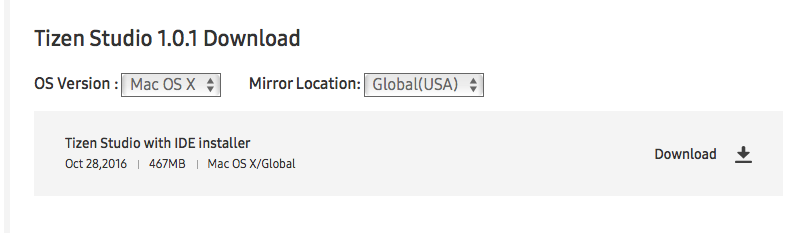
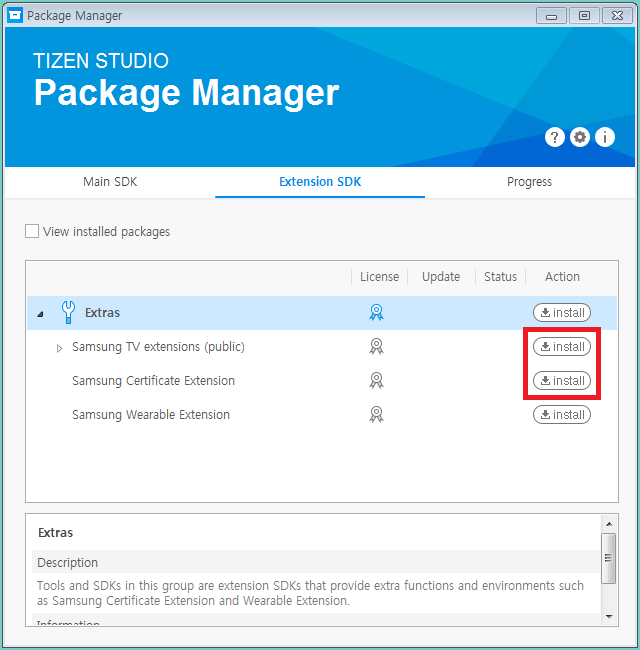
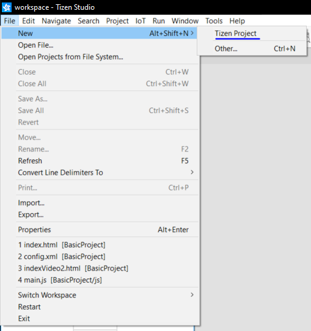
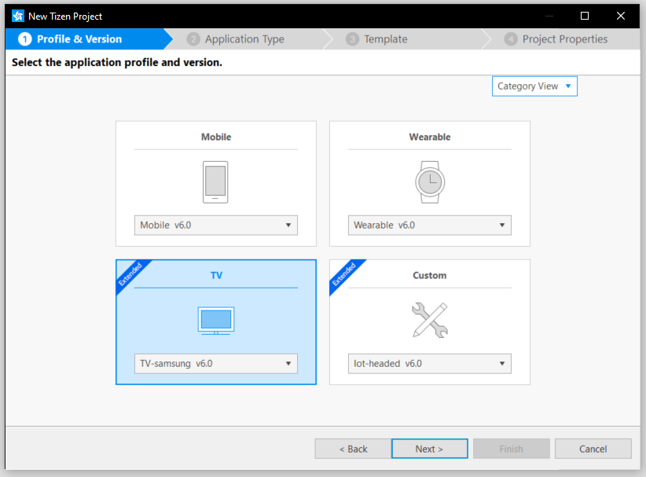
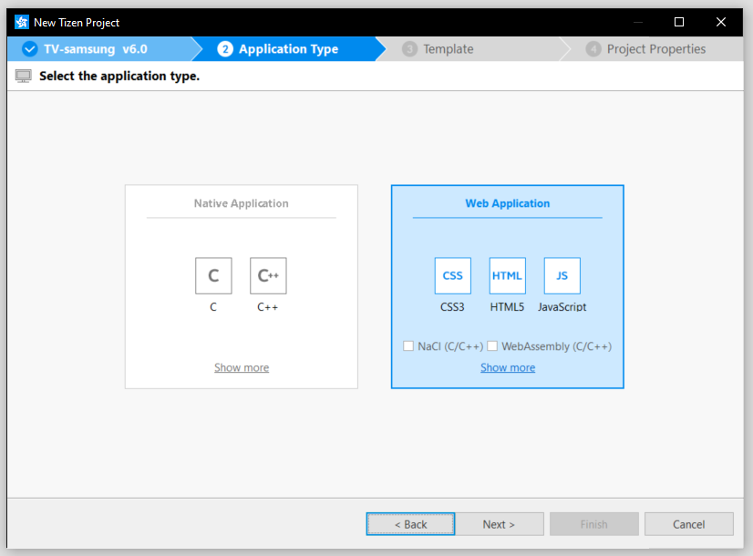
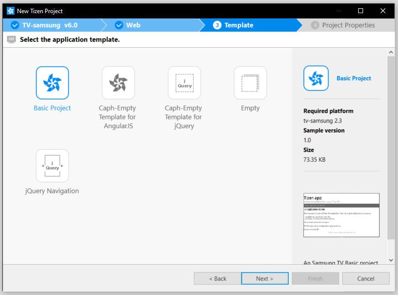
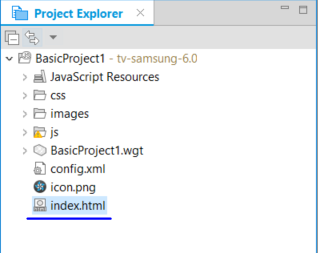

# Integrations 

## New Relic

This document describes the integration of a New Relic tracker and NexPlayer. 

### Quick start

The two following scripts must be included before NexPlayer does:

```js
    <!-- newrelic browser agent. REMEMBER TO REPLACE THIS SCRIPT WITH YOUR OWN BROWSER AGENT -->
    <script type="text/javascript" src="./agent.js"></script>

    <!-- newrelic tracker. Ask NexPlayer team for the library -->
    <script type="text/javascript" src="./newrelic-video-nexplayer.min.js"></script>
```

In order to make New Relic work the property 'useNewRelicTracker' must be set to true in the Setup:

```js
    var player = null;
    var video = null;

    // Pass this function to the Setup method as below
    var callBackWithPlayers = function (nexplayerInstance, videoElement) {

        // Retrieve the player and video instances
        player = nexplayerInstance;
        video = videoElement;
    };

    // Create and initialize the player
    nexplayer.Setup({
        key: 'YOUR LICENSE KEY', 
        div: document.getElementById('player'),     
        callbacksForPlayer: callBackWithPlayers,
        src: 'YOUR STREAM URL'
        useNewRelicTracker: true,
        // ...
    });
```

Adding these two scripts and the property is all it takes for New Relic to work along NexPlayer. Note that the "agent" script is a customer's own file while "newrelic-video-nexplayer.min.js" is provided by our team and must be requested in order to make use of it. No extra steps are needed in order to set the communication between the player and the tracker as that is already managed via the latter script.

### Methods

Custom data to be tracked can be added and removed using the following methods:
 - [addTrackerData()](ps5/api.md?id=addtrackerdata)
 - [removeTrackerData()](ps5/api.md?id=removetrackerdata)

## Tizen Studio

### How to integerate NexPlayer Tizen SDK 

This document describes the integration of the NexPlayer Tizen SDK and the detailed steps
to create a sample application.

### Prerequisites 

#### Setting Environment

1. Download and Install the Tizen Studio IDE from this [link](http://developer.samsung.com/tv/develop/tools/tizen-studio/). Make sure to select the appropriate Operating System 


2. Install the Tizen TV SDK from [here]( http://developer.samsung.com/tv/develop/tools/tv-extension/download).


3. Configure the Tizen TV Emulator. Go to Tools-->Emulator Manager. Click on Create button and follow the instructions in the screen. The default settings can be keept.


4. The Tizen certification is required to run a package on the Emulator or on a real-device. Click on Tools-->Package Manager to obtain it.
Follow [this](https://docs.tizen.org/application/vstools/tools/certificate-manager/) guide to see all the steps.

### How to create a simple Tizen TV application using NexPlayer Tizen SDK

#### Create a Basic Project using Tizen Studio

1. Create a new project Click on File -> New -> Tizen Project. 


2. Select the type of the project.  


3. Now select web aplication.  


4. To finish select basic project.  


4. Open the next index.  


5. And you can use the following code.

```html
  <!DOCTYPE html>
<html>
<head> 
    <!-- MANDATORY! LOAD JQUERY BY CDN OR LOCAL  -->
    <meta charset="UTF-8">
    <meta name="viewport" content="width=device-width, initial-scale=1.0, maximum-scale=1.0, user-scalable=no" />
    <title>NexPlayer</title>
    <style type="text/css">
        #player_container {
            width: 90%;
            margin: auto;
            padding-top: 50.625%; /* 16:9 Aspect Ratio 56.25 * 0.9 */
            position: relative;
        }
        @media (min-width: 75rem) {
            #player_container {
                width: 50%;
                padding-top: 28.125%; /* 16:9 Aspect Ratio 56.25 * 0.5 */
            }            
        }
        h1 {
            text-align: center;
        }
        #player {
            background-color: black;
            position: absolute;
            top: 0px;
            width: 100%;
            height: 100%;
        }
        #warning {
            background-color: red;
            text-align: center;
            display: none;
        }
    </style>
</head>
<body style="background:white">
    <h1>NexPlayer for Tizen WebApps</h1>
    <div id="player_container">
        <div id="player"></div>
    </div>
    <!-- MANDATORY! LOAD NEXPLAYER WITH THE TAG "DEFER" -->
    <script src="NEXPLAYER LIB" defer></script>
    <script type="text/javascript">
    window.addEventListener('load', function() {
        nexplayer.Setup({
            key: "YOUR KEY",
            div: document.getElementById('player'),
            src: 'https://dash.akamaized.net/akamai/bbb_30fps/bbb_30fps.mpd',
        });
})
    </script>
</body>
</html>
```

#### Building and Running the Project

To launch the project on Tizen TV Check [this](https://developer.samsung.com/smarttv/develop/getting-started/using-sdk/tv-device.html)
 guide.

To launch the project on Smart TV Emulator Check [this](https://developer.samsung.com/smarttv/develop/getting-started/using-sdk/tv-emulator.html)
 guide.


While using Tizen Studio, if your app works in the simulator and it doesn't in a device nor the emulator, add the next line to your config.xml:

```xml
<access origin="*" subdomains="true"></access>
```

## PlayStation 5

PlayStation 5 is supported from NexPlayer's version [3.2.1](/ps5/releases.md?id=version-321)
In order to be able to use NexPlayer's SDK for PS5, a JSON file is needed. This JSON file must be hosted in the root of the domain where the application is hosted. For example, if the app is hosted in https://example.com/app the JSON file must be accessible from the path https://example.com/userAppId.json.

Please, contact NexPlayer's support (supportmadrid@nexplayer.com) to request this file.

<a id="verimatrix-top"> </a>

## Verimatrix Watermarking

Verimatrix Watermarking provides additional security into the contents by adding a imperceptible watermark on the video.

### Using with the player

To start, you need to request a watermark.min.js file from Verimatrix here https://www.verimatrix.com/products/watermarking/.


```html
<!DOCTYPE html>
<html>

<head>
  <meta charset="UTF-8">
  <meta name="viewport" content="width=device-width, initial-scale=1.0, maximum-scale=1.0, user-scalable=no" />
  <title>NexPlayer</title>
  <link rel="stylesheet" href="your-style.css">
</head>

<body>
  <div id="player_container">
    <div id="player" width="560" height="315"></div>
  </div>
  <script src="Your nexplayer.js file."></script>
  <script>

    var player = null;
    var videoElem = null;
    var callBackWithPlayers = function (nexplayerInstance, videoElement) {
      player = nexplayerInstance;
      videoElem = videoElement;
    }

    nexplayer.Setup({
      key: "LICENSE KEY",
      div: document.getElementById('player'),
      autoplay: true,
      mutedAtStart: true,
      debug: false,
      callbacksForPlayer: callBackWithPlayers,
      src: 'STREAM SRC',
      wmInfo = {
        strength: 255,
        transactionId: 12424,
        apiToken: 't1EKhe8A',
        logoImage: "Image URL",
        logoPos: [5, 5, 340, 90]
      }
    });

  </script>
</body>

</html>

```

### wmInfo Object

| Param | Type | Description |
| --- | --- | --- |
| strength | Integer | Watermark strength.<br/> Valid values:<br/>• 255: Visible watermark for debugging <br/>• 1 to 100: Production watermark strength<br/>(1 = weakest, 100 = strongest/possibly visible) <br/>A stronger watermark is faster to extract.<br/>Values of 50 or less require very long videos to extract.<br/> Default: 80 |
| transactionId | Unsigned <br/> integer | Transaction or user identifier. <br/> Required for watermarking initialization. <br/> Size: 36 bits <br/> Valid values: 0 to 687194767365 | 
| operatorId | Unsigned <br/> integer | Operator identifier.<br/> You do not need to provide operatorId as it is hard-coded to an operator-specific value in the software.
| logoImage | String | Optional.<br/>URL for a visible image to draw in addition to the imperceptible watermark.<br/>Default: None | 
| logoPos | Array \<number\> | Optional.<br/>Set coordinates for the logo image.<br/>Format: [x, y, width, height]<br/>Valid values for x and y: 0 to 100 <br/> Default: Upper left corner of the video.| 
| apiToken | String | Optional.<br/>Opaque string for activating subsequent API actions. |


