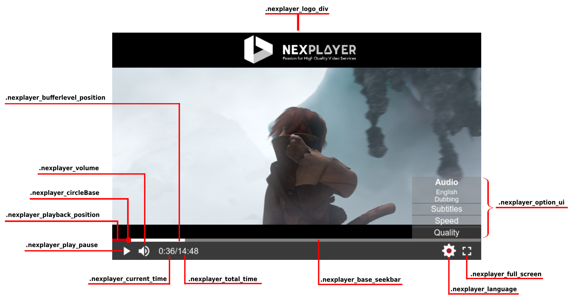
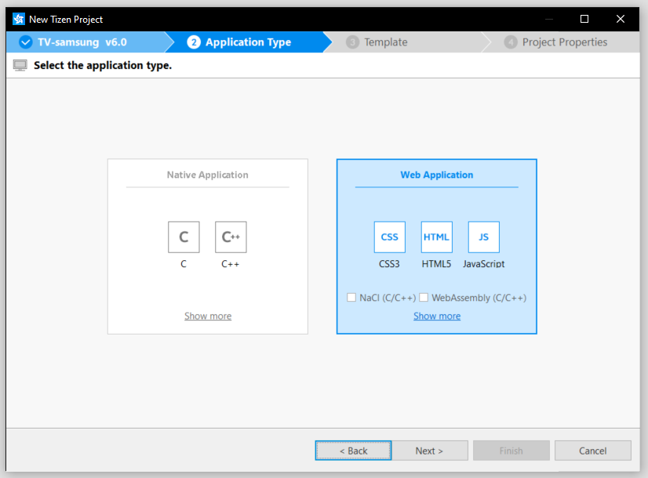

<a id="ps5_xbox_tizen_webos_usage-top"> </a>

# PlayStation 5, Xbox, Tizen and WebOS Usage

This section explains how to integrate NexPlayer&#x2122; into your project. Note that PS4 uses a different SDK which is fully explained <a href="https://nexplayer.github.io/TizenWebOS/#/ps4usage?id=ps4usage-top">here</a>.

## NexPlayer™ Integration

### Sample

Integrating NexPlayer&#x2122; into an  <a href="https://nexplayer.nexplayersdk.com/sample/index.html" download="" target="_blank">HTML5 file</a>:</p>
```html
<!DOCTYPE html>
<html>
<head> 
    <!-- MANDATORY! LOAD JQUERY BY CDN OR LOCAL  -->
    <script src="https://ajax.googleapis.com/ajax/libs/jquery/3.4.1/jquery.min.js"></script>
    <meta charset="UTF-8">
    <meta name="viewport" content="width=device-width, initial-scale=1.0, maximum-scale=1.0, user-scalable=no" />

    <title>NexPlayer</title>
    <style type="text/css">
        #player_container {
            width: 90%;
            margin: auto;
            padding-top: 50.625%; /* 16:9 Aspect Ratio 56.25 * 0.9 */
            position: relative;
        }
        @media (min-width: 75rem) {
            #player_container {
                width: 50%;
                padding-top: 28.125%; /* 16:9 Aspect Ratio 56.25 * 0.5 */
            }            
        }
        h1 {
            text-align: center;
        }
        #player {
            background-color: black;
            position: absolute;
            top: 0px;
            width: 100%;
            height: 100%;
        }
        #warning {
            background-color: red;
            text-align: center;
            display: none;
        }
    </style>
</head>

<body>
    <h1>NexPlayer for WebApps</h1>
    <div id="warning">
        <h1>Unsupported protocol</h1>
        <h3>Loading HTML using the file protocol can't be supported.</h3>
    </div>
    <div id="player_container">
        <div id="player"></div>
    </div>
    <!-- MANDATORY! LOAD NEXPLAYER WITH THE TAG "DEFER" -->
    <script src="Latest SDK version. Check 'Releases' section" defer></script>
    <script type="text/javascript">
    //Wait the document to be ready
    $( document ).ready(function() {

        nexplayer.Setup({
            key: "ENTER YOUR LICENSE KEY HERE",
            div: document.getElementById('player'),
            src: 'http://commondatastorage.googleapis.com/gtv-videos-bucket/sample/BigBuckBunny.mp4', // Example URL

        });
        if(window.location.protocol ==  'file') {
            document.getElementById('warning').style.display = "inherit";
        }
    })
    </script>
</body>
</html>
```


<div class="alert alert-success hints-alert"><div class="hints-icon"><i class="fa fa-mortar-board"></i></div><div class="hints-container"><p>Please note that replacing the license key is mandatory. License key should have been already sent to your inbox or you can request one from support.madrid@nexplayer.com. Also don't forget to load jquery and add the "defer" tag to the nexplayer.js loading script.</p>
</div></div>

### Step-by-Step

To integrate NexPlayer™ into your project you must complete the following steps:

- The NexPlayer™ JavaScript library should be included in the HTML file:

```html
<script src="Latest SDK version. Check 'Releases' section" defer></script>
```

<div class="alert alert-success hints-alert"><div class="hints-icon"><i class="fa fa-mortar-board"></i></div><div class="hints-container"><p>Please note that the use of https to call our library is mandatory. <br>
Also is necessary to use the "defer" tag.</p>
</div></div>

- A div that will contain the video and the UI has to be declared:
```html
<body>
...
    <div id="player"></div>
...
</body>
```
- The player should be initialized by entering the previous div to the Setup method:
```js
nexplayer.Setup({
    key: 'ENTER YOUR LICENSE KEY HERE',
    div: document.getElementById('player'),
    src: 'http://commondatastorage.googleapis.com/gtv-videos-bucket/sample/BigBuckBunny.mp4'
});
```

### Remote Controller

You can create your own custom controls for a seemless integration of NexPlayer™ into your Tizen app:

```js
document.addEventListener('keydown', function(e) {
    console.log('Key pressed ---> ' + e.keyCode);
        switch (e.keyCode) {
        case 13:    // Enter
            player.buttonsClickFocus();
            break;
        case 37: // LEFT arrow
        if (player.isPlayBackBarFocused() || !player.isControlBarOpen()) {
            if (!player.isControlBarOpen()) {
            player.toggleControlBar();
            player.focusOnPlaybackBar();
            }
            player.seek(videoElement.currentTime - 60);
        } else {
            player.buttonsPreviousFocus();
        }
        break;
        case 39: // RIGHT arrow
        if (player.isPlayBackBarFocused() || !player.isControlBarOpen()) {
            if (!player.isControlBarOpen()) {
            player.toggleControlBar();
            player.focusOnPlaybackBar();
            }
            player.seek(videoElement.currentTime + 60);
        } else {
            player.buttonsNextFocus();
        }
        break;
        case 38:    // UP arrow
        if (player.isLanguageMenuOpen()) {
            player.upSubtitle();
        } else {
            player.upFocus();
        }
        break;
        case 40:    // DOWN arrow
        if (player.isLanguageMenuOpen()) {
            player.downSubtitle();
            break;
        }

        if (!player.isControlBarOpen()) {
            //player.toggleControlBar();
            player.focusOnButtonsBar();
        } else {
            player.downFocus();
        }
        break;
        }
    });
```


#### Details

Navigating inside the NexPlayer™ UI can be done by shifting the focus from one element to another with the remote controller. A function can be assigned to one of the buttons of the remote controller using remote control key codes:
```js
{
    case 13:    // Enter button for Samsung Controler
    player.buttonsClickFocus();
    break;
}
```

<div class="alert alert-success hints-alert"><div class="hints-icon"><i class="fa fa-mortar-board"></i></div><div class="hints-container"><p>Please note the need for a <b>'break;'</b> line to exit each controller action </p>
</div></div>

All cases must be placed inside a listener to be able to operate at runtime: 
```js
document.addEventListener('keydown', function(e) {
    console.log('Key pressed ---> ' + e.keyCode);
    switch (e.keyCode) {        
        "YOUR CONTROLS HERE"            
    }
}      
```


## NexPlayer™ Configuration

There are a substantial number of customizable options for NexPlayer™ including: the name and subtitle format of the video, a logo for the company, the DRM information, a VAST link, and the thumbnail preview...

```js
    key: 'License key to validate the playback', // Mandatory
    div: document.getElementById('player'), // Mandatory
    src: 'URL video', // Mandatory
    adsDelay: number, // Optional, used to add a delay before the ad starts playing. Specified in milliseconds
    adsMode: string, // Optional, used to select the ad library. Can be 'ima', 'pal' or 'default'.
    addRequestFilter: Function, // Optional, used for give filters to the drm request
    autoplay: true, // Optional
    callbacksForLogger: callback, // Optional callback called with the logger instances
    callbacksForReturn: callback, // Optional callback called with the return button
    callbackForSubtitles: callback, // Optional callback called with the subtitles instance
    callbacksForPlayer: callback, // Optional callback called with the player instances
    cast: boolean, // Optioanl, used to determines if the cast will be enabled or not
    debug: true, // Optional
    defaultLanguage: string, // Optional
    disableKeyEvents: false, // Optional
    drm: [{
        NexDRMType:'DRM Type (eg. com.widevine.alpha(', NexDRMKey: 'URI for the DRM Key', 
        NexHeaders:[{FieldName: 'Header Field Name', FiledValue: 'Header Field Value'}],
        NexCallback:OptionalDRMCallbackForFairPlay
    }], // Optional DRM information
    dynamicThumbnails: false, // Optional, none of the following properties is required
    externalSubtitles: {
        src: "URL for the subtitles file",
        language: "Subtitle language",
        callback: function(e), // Error callback for subtitles (returns any received errors)
    }, 
    // Optional, only WEBVTT subtitles can be used. "language" property is a string that 
    // define how the subtitle will be identified.
    hideControlBarOnStart: boolean, // Optional
    hideUITime: boolean, // Optional
    improveStartUp: boolean // Optional
    logosrc: 'URL logo of the company', // Optional
    mutedAtStart: true, // Optional    
    preferredAudioCodec: Array, // This property can be used to give priority to a specific audio codec.
    poster: 'URL poster', // Optional
    subtitle: 'Subtitle name of the video', // Optional
    reinitializeAfterAds: boolean, // Optional, used to avoid errors related to ads on Tizen 2020.
    resumePosition: number, // Optional, used for starting the video from the given position in seconds.
    showAdsUI: true, // Optional, used for showing the player controls when an ad is playing
    showingFullUI: true, // Optional, used for showing the player controls
    staticThumbnails: {
        src: 'URL of the VTT file',
        img: 'URL of the Image to fetch thumbs from',
        callback: function(e), // Error callback for thumbnails (returns any received errors)
    }, // Optional
    startFullscreen: true, // Optional
    startingBufferLength: 50, // Number of seconds the player will try to achieve when initializing
    title: 'Name of the Video', // Optional
    trailer: boolean,// Optional, by default is set to false. Set to true when a stream should be considered a trailer, false when not.
    type_360: '360 visualisation type' // Optional, 'equirectangular' or 'cubemap'.
    useDefaultControls: true, // Optional, allows usage of remote controller
    useNewRelicTracker: boolean,
    // By default is set to false. Set to true in order to use the tracker. 
    // You need the tracker library in order to be able to use the tracker. Ask NexPlayer team for it.
    vast: 'URL with a VAST/VPAID/VMAP advertisement', // Optional
    adsParamsToEncode: [ e.g. "video_url_to_fetch"], // Optional. Array of strings that specifies the name of the VAST ad URL parameters to encode.
```

## NexPlayer™ API

***

### Overview

***

#### Nexplayer methods

 - [Setup(configObj)](#setup)
 - [ChangeSource({src: newSrc, drm: newDrm})](#changesource)
 - [UnMount(player)](#unmount)
 - [IsReady()](#isready)
 - [AdsEvents()](#adsevents)
 - [RemoveAdsEvents()](#removeadsevents)

#### Player methods and objects

##### Miscellaneous


 - [play()](#play)
 - [pause()](#pause)
 - [destroy(UnMount(player))](#destroy)
 - [on(callbackType, functionToBeCalled)](#on)
 - [off(callbackType)](#off)
 - [enableABR()](#playerenableabr)
 - [addTrackerData()](#addtrackerdata)
 - [removeTrackerData()](#removetrackerdata)
 - [trickplay(value)](#trickplay)

##### Navigation


 - [downFocus()](#downfocus)
 - [downSubtitle()](#downsubtitle)
 - [focusOnButtonBar()](#focusonbuttonbar)
 - [focusOnPlaybackBar()](#focusonplaybackbar)
 - [upFocus()](#upfocus)
 - [upSubtitle()](#upsubtitle)
 - [seek(value)](#seek)
 - [seekLive()](#playerseekLive)

##### Player state


 - [isControlBarOpen()](#iscontrolbaropen) ⇒ boolean
 - [isCurrentAssetAd()](#iscurrentassetad) ⇒ boolean
 - [isCurrentAssetMuted()](#iscurrentassetmuted) ⇒ boolean
 - [isLanguageMenuOpen()](#islanguagemenuopen) ⇒ boolean
 - [isLive()](#islive) ⇒ boolean
 - [isPlaybackBarFocused()](#isplaybackbarfocused) ⇒ boolean

##### Toggle


 - [toggleControlBar()](#togglecontrolbar)
 - [toggleLanguageMenu()](#togglelanguagemenu)
 - [togglePlayPause()](#toggleplaypause)

##### Getters


 - [getAudioStreams()](#getaudiostreams) ⇒ [Array\<AudioStream\>](#audiostream)
 - [getCurrentContentType()](#getcurrentcontenttype) ⇒ string
 - [getCurrentAudioStream()](#getcurrentaudiostream) ⇒ [AudioStream](#audiostream)
 - [getCurrentSubtitle()](#getcurrentsubtitle) ⇒ number
 - [getCurrentTime()](#getcurrenttime) ⇒ number
 - [getCurrentTrack()](#getcurrenttrack) ⇒ [Track](#track-object)
 - [getDroppedFrames()](#getdroppedframes) ⇒ number
 - [getDuration()](#getduration) ⇒ number
 - [getMediaElement()](#getmediaelement) ⇒ HTMLVideoElement
 - [getPlayBackRate()](#getplaybackrate) ⇒ number
 - [getProtocol()](#getprotocol) ⇒ number
 - [getQualityLevels()](#getqualitylevels) ⇒ array
 - [getSubtitles()](#getsubtitles) ⇒ array
 - [getThumbnailAt()](#getthumbnailat) ⇒ Promise
 - [getThumbnails()](#getthumbnails) ⇒ [Array\<Frame\>](#frame)
 - [getTracks()](#gettracks) ⇒ [Array\<Track\>](#track)
 - [getURL()](#geturl) ⇒ string
 - [getVersion()](#getversion) ⇒ string

##### Setters


 - [setAudio(streamID)](#setaudio)
 - [setAudioStream(streamID)](#setaudiostream) ⇒ deprecated
 - [setCurrentTrack(trackID)](#setcurrenttrack)
 - [setSpeed(speed)](#setspeed)
 - [setSubtitle(subID)](#setsubtitle)
 - [setTrack(qualityLevel)](#settrack)

##### Static enums


 - [NexProtocol](#nexprotocol): enum
 - [NexEvent](#nexevent): enum
 - [THUMB_TYPE](#thumbtype): enum

##### Global Typedefs


 - [AudioStream](#audiostream) : object
 - [Frame](#frame) : object
 - [NexDRMInformation](#nexdrminformation) : object
 - [NexHeaders](#nexheaders) : object
 - [Track](#track) : object

#### Ads methods and objects

Please, consult this <a href ="https://nexplayer.github.io/TizenWebOS/#/ps5_xbox_tizen_webos_usage?id=ads" target="_blank"> link </a> for information on how to use ad events.

##### Miscellaneous

 - [play()](#adplay)
 - [pause()](#adpause)

##### Getters


 - [getAdCurrentTime()](#getadcurrenttime) ⇒ number
 - [getAdDescription()](#getaddescription) ⇒ string
 - [getAdDuration()](#getadduration) ⇒ number
 - [getAdPause()](#getadpause) ⇒ boolean
 - [getAdRemainingTime()](#getadremainingtime) ⇒ number
 - [getAdTitle()](#getadtitle) ⇒ string
 - [getIsSkippableAd()](#getisskippablead) ⇒ boolean
 - [getMute()](#getmute) ⇒ boolean
 - [getVolume()](#getvolume) ⇒ number

##### Setters


  - [setMute(state)](#setmute)
  - [setVolume(value)](#setvolume)

***


### Nexplayer methods

***

#### <a id="setup"></a> nexplayer.Setup(configObj)

Creates and initializes the player.

Set NexPlayer settings using the configuration object as is indicated in this <a href ="https://nexplayer.github.io/TizenWebOS/#/gettingstarted?id=nexplayer%e2%84%a2-configuration" target="_blank">link</a>.

**Type**: method of [<code>nexplayer</code>](#nexplayer-methods)

**Parameters**: <code>configObj</code> is an object which values could be:

| Param | Type | Description |
| --- | --- | --- |
| key | <code>string</code> | NexPlayer key to validate the playback. |
| div | <code>HTMLDivElement</code> | The div container of the player. |
| src | <code>string</code> | URL of the video to be played. |
| adsDelay | <code>number</code> | Determines the delay before the ad starts playing. |
| adsMode | <code>string</code> | Determines the ad library: 'ima', 'pal' or 'default'. |
| addRequestFilter | <code>Function</code> | Sets a function that receives the DRM request as a parameter and changes its Headers. |
| autoplay | <code>boolean</code> | Determines if the video must start playing or paused. True by default. |
| callbackForLogger | <code>Function</code> | Function to be called when the logger shows a message. |
| callbackForReturn | <code>Function</code> | Sets a callback to be executed when the corresponding button is clicked. |
| callbackForSubtitles | <code>Function</code> | Sets a callback to be executed when the corresponding subtitle is loaded. |
| callbacksWithPlayers | <code>Function</code> | Used for retrieving the nexplayer instance and video element. This is necessary for getting the instance and use the NexPlayer API. |
| cast | <code>boolean</code> | Determines if the cast will be enabled or not. |
| debug | <code>boolean</code> | Determines if log information is showed. By default is set to true. |
| defaultLanguage | <code>string</code> | Determines which is the default audio language. |
| disableKeyEvents | <code>boolean</code> | Determines if the keyboard keys can be used to control the video. |
| drm | <code>Object</code> | Contains an object of DRM information. By default it’s set to null. |
| externalSubtitles | <code>Object</code> | Used to provide a WEBVTT file as external subtitles. |
| hideControlBarOnStart | <code>boolean</code> | Determines if the control bar will hide when the video starts. |
| hideUITime | <code>boolean</code> | Determines if the time will be hidden in the UI. |
| improveStartUp | <code>boolean</code> | Determines whether the video has to start at the lowet bitrate or not. |
| logosrc | <code>string</code> | Company URL logo. |
| mutedAtStart | <code>boolean</code> | Determines if the video will start playing muted or not. False by default. |
| preferredAudioCodec | <code>Array</code> | Determines the codec priority. |
| poster | <code>string</code> | Video poster URL. |
| subtitle | <code>string</code> | Subtitle name of the video. |
| reinitializeAfterAds | <code>boolean</code> | Used to avoid errors related to ads on PS5, please set it to true on this platform. False by default. |
| resumePosition | <code>number</code> | Determines the position where the video will start playing. |
| showAdsUI | <code>boolean</code> | Determines if the UI for ads is hidden or not. |
| showingFullUI | <code>boolean</code> | Determines if the UI is hidden or not. |
| staticThumbnails | <code>Object</code> | Thumbnail properties: VTT URL, image URL and callback. |
| startFullScreen | <code>boolean</code> | Determines if the video will start on full screen. |
| startingBufferLength | <code>number</code> | Determines the starting buffer lenght. |
| title | <code>string</code> | Video name. |
| trailer | <code>boolean</code> | Determines if a stream should be considered a trailer. |
| type_360 | <code>string</code> | Select the 360 video format to play. Possible values are 'equirectangular' and 'cubemap' |
| useDefaultControls | <code>boolean</code> | Determines if the tv controller will be able to be used to navigate in the UI. |
| useDynamicThumbnails | <code>boolean</code> | Determines if dynamic thumbnails are used. By default this values is set to false. |
| useNewRelicTracker | <code>boolean</code> | Determines if the New Relick tracker will be used. |
| vast | <code>string</code> | Advertisement url that is going to be played. VAST, VPAID, VMAP are supported. |
| adsParamsToEncode| <code>Array<string></code> | Specifies the name of the VAST ad URL parameters to encode. Maximum size of |

#### <a id="changesource"></a> nexplayer.ChangeSource({src: newSrc, drm: newDrm}))

Change the url stream of the video. It is possible to set a new url with new drm config if necessary.

**Type**: method of [<code>nexplayer</code>](#nexplayer-methods)

**Parameters**: <code>configObj</code> is an object which values could be:

| Param | Type                | Description        |
| ----- | ------------------- | ------------------ |
| src   | <code>string</code> | URL of the video to be played. |
| drm   | [NexDRMInformation](#NexDRMInformation) | Contains an object of DRM information. |

***

#### <a id="unmount"></a> nexplayer.UnMount(player)

Unmounts the player and its dependencies. In order to properly clear the player this method must be called after destroying the very same player. Check more details <a href="https://nexplayer.github.io/TizenWebOS/#/API?id=destroy">here</a>. 

**Type**: method of [<code>nexplayer</code>](#nexplayer-methods)

**Parameters**:

| Param | Type                | Description        |
| ----- | ------------------- | ------------------ |
| player | <code>HTMLElement</code> | Player tag |

***

#### <a id="isready"></a> nexplayer.IsReady()

Fetches the player mount/unmount status. If true, it can be mounted again.

**Type**: method of [<code>nexplayer</code>](#nexplayer-methods)

**Returns**: boolean - Whether the player is ready to be mounted or not.

#### <a id="adsevents"></a> nexplayer.AdsEvents([<code>"adEvent"</code>](#ads-events), function () {}) 

Add a listener for the specified ad event.

**Type**: method of [<code>nexplayer</code>](#nexplayer-methods)

   #### <a id="removeadsevents"></a> nexplayer.RemoveAdsEvents([<code>"adEvent"</code>](#ads-events), function () {}) 

Remove a listener for the specified ad event which has been previously registered.

**Type**: method of [<code>nexplayer</code>](#nexplayer-methods)

***

### Player methods and objects

***

#### Miscellaneous

***

   #### <a id="play"></a> player.play()

Play the video.

**Type**: instance method of [<code>Player</code>](#Player)

   #### <a id="pause"></a> player.pause()

Pause the video.

**Type**: instance method of [<code>Player</code>](#Player)

   #### <a id="destroy"></a> player.destroy().then(UnMount(document.getElementById('player')))

Destroys the player. This method returns a promise which must call to UnMount as soon as it is resolved.
This way, the player will be completely destroyed and new instances could be created afterwards. The UnMount
method must be called from the 'nexplayer' instance and needs the 'player' element to be passed as argument.

**Type**: instance method of [<code>Player</code>](#Player)

   #### <a id="on"></a> player.on(callbackType, functionToBeCalled)

Add a listener for a event.

**Type**: instance method of [<code>Player</code>](#Player)      
**Parameters**:

| Param              | Type                  | Description                   |
| ------------------ | --------------------- | ----------------------------- |
| callbackType       | <code>NexEvent</code> | Event to listen for           |
| functionToBeCalled | <code>Function</code> | Function called on each event |

   #### <a id="off"></a> player.off(callbackType)

Remove a listener for a event.

**Type**: instance method of [<code>Player</code>](#Player)      
**Parameters**:

| Param              | Type                  | Description                   |
| ------------------ | --------------------- | ----------------------------- |
| callbackType       | <code>NexEvent</code> | Event to remove the listener from |

   #### <a id="enableabr"></a> player.enableABR()

Enable the ABR to change automatically between tracks.

**Type**: instance method of [<code>Player</code>](#Player)   

   #### <a id="addtrackerdata"></a> player.addTrackerData(key, value)

Adds custom data into New Relic's tracker if initialized.

**Type**: instance method of [<code>Player</code>](#Player)  
**Parameters**:

| Param | Type                | Description        |
| ----- | ------------------- | ------------------ |
| key   | <code>string</code> | Data variable name |
| value | <code>any</code>    | Data value         |

   #### <a id="removetrackerdata"></a> player.removeTrackerData(key)

Removes custom data from New Rellic's tracker if initialized.

**Type**: instance method of [<code>Player</code>](#Player)  
**Parameters**:

| Param | Type                | Description        |
| ----- | ------------------- | ------------------ |
| key   | <code>string</code> | Data variable name |

   #### <a id="trickplay"></a> player.trickplay(value)

Sets the trick play value. A value bigger than 1 will move the seek time forward. A value negative will move it backward. Setting trick play value to 1 will end trick play and seek to the calculated seek time. This seek time results from the provided value which will increase the time to seek depending on how much time the trickplay is executed. Then, it will trigger an event trickPlayStarted when the value is changed, a trickPlayTimeUpdate event will be thrown every time the seek time changes, and trickPlayEnded event when the trick play stops. Use player.play(), player.stop() or player.seek() will finish the trick play.

**Type**: instance method of [<code>Player</code>](#Player) 

| Param | Type |Description |
| --- | --- | --- |
| value | Number | number of times per second to update the seek time. |

***

#### Navigation

***

  #### <a id="downfocus"></a> player.downFocus()

Focus the element of the UI situated directly below the element currently focused.

**Type**: instance method of [<code>Player</code>](#Player)

  #### <a id="downsubtitle"></a> player.downSubtitle()

Changes the current subtitles to the previous one in the subtiltle track playlist.

**Type**: instance method of [<code>Player</code>](#Player)

  #### <a id="focusonbuttonbar"></a> player.focusOnButtonBar()

Changes the focus to the play/pause button.

**Type**: instance method of [<code>Player</code>](#Player)

  #### <a id="focusonplaybackbar"></a> player.focusOnPlaybackBar()

Changes the focus to the video's seekbar.

**Type**: instance method of [<code>Player</code>](#Player)

  #### <a id="upfocus"></a> player.upFocus()

Focus the element of the UI situated directly above the element currently focused.

**Type**: instance method of [<code>Player</code>](#Player)

  #### <a id="upsubtitle"></a> player.upSubtitle()

Changes the current subtitles to the following one in the subtiltle track playlist.

**Type**: instance method of [<code>Player</code>](#Player)

  #### <a id="seek"></a> player.seek(value)


Set the currentTime property of the attached video element. (if isUTC is true, the seek value will be in a different format than the currentTime of the video element).

**Type**: instance method of [<code>Player</code>](#Player) 

| Param | Type  | Description                                    |
| ----- | ----- | ---------------------------------------------- |
| event | Event | value in seconds that the player will seek to. |

```js
//Non-live video 
player.seek(120) // It seeks into minute 2:00 in the video (120 secs), must be a positive number ranging from 0 to the full duration of the video in seconds
//Live video
player.seek(-120) // It jumps back 2 minutes (120 secs) from the current live time, must be a negative number ranging from minus {the DVR window size} to 0
```

  #### <a id="seeklive"></a> player.seekLive()

Jump to the livestream current time from the current position (if isUTC is true, the seek value will be in a different format than the currentTime of the video element). only works in livestream.

**Type**: instance method of [<code>Player</code>](#Player) 


***

#### Player states

***

   #### <a id="iscontrolbaropen"></a> player.isControlBarOpen() ⇒ boolean

**Type**: instance method of [<code>Player</code>](#Player)

**Returns**: boolean - *true* if the bar is showing. *false* otherwise.

   #### <a id="iscurrentassetad"></a> player.isCurrentAssetAd() ⇒ boolean

Indicates whether the current asset playing is an ad or not

**Type**: instance method of [<code>Player</code>](#Player)

**Returns**: boolean - *true* if the current asset is an ad. *false* otherwise.

   #### <a id="iscurrentassetmuted"></a> player.isCurrentAssetMuted() ⇒ boolean

Indicates whether the ad or the main content is muted or not.

**Type**: instance method of [<code>Player</code>](#Player)

**Returns**: boolean - *true* if the current asset is muted. *false* otherwise.

   #### <a id="islanguagemenuopen"></a> player.isLanguageMenuOpen() ⇒ boolean

**Type**: instance method of [<code>Player</code>](#Player)

**Returns**: boolean - *true* if the Language/Subtitle menu is showing. *false* otherwise.

   #### <a id="islive"></a> player.isLive() ⇒ boolean

**Type**: instance method of [<code>Player</code>](#Player)

**Returns**: boolean - *true* if the video is live, *false* otherwise.

   #### <a id="isplaybackbarfocused"></a> player.isPlaybackBarFocus() ⇒ boolean

**Type**: instance method of [<code>Player</code>](#Player)

**Returns**: boolean - *true* if the seek bar of the video is currently focused, *false* otherwise.


***

#### Toggle

***

  #### <a id="togglecontrolbar"></a> player.toggleControlBar()

Shows or hides the bottom bar.

**Type**: instance method of [<code>Player</code>](#Player)

  #### <a id="togglelanguagemenu"></a> player.toggleLanguageMenu()

Opens or closes the language menu.

**Type**: instance method of [<code>Player</code>](#Player)

  #### <a id="toggleplaypause"></a> player.togglePlayPause()

Toggle the video playback between the play and pause states.

**Type**: instance method of [<code>Player</code>](#Player)

***

#### Getters

***

   #### <a id="getaudiostreams"></a> player.getAudioStreams() ⇒ Array< AudioStream >

Get the available audio streams.

AudioStream:

| Property | Type | Description |
| --- | --- | --- |
| id | <code>number</code> | of the audio to be played. |
| language | <code>string<NexDRMInformation></code> | that contains an string with languages audio available (by default it is empty). |
| name | <code>string<NexDRMInformation></code> | that contains an string with name of audio files available (by default it is empty). |

**Type**: instance method of [<code>Player</code>](#Player)   
**Returns**: Array\<AudioStream\> - the list of the available audio streams.

   #### <a id="getcurrentaudiostream"></a> player.getCurrentAudioStream() ⇒ AudioStream

Get the audio stream currently in use.

AudioStream:

| Property | Type | Description |
| --- | --- | --- |
| id | <code>number</code> | of the audio to be played. |
| language | <code>string<NexDRMInformation></code> | that contains an string with languages audio stream currently in use (by default it is empty). |
| name | <code>string<NexDRMInformation></code> | that contains an string with name of audio stream currently in use (by default it is empty). |

**Type**: instance method of [<code>Player</code>](#Player)   
**Returns**: Array\<TrackInfo\> - information about the current audio track.

   #### <a id="getcurrentcontenttype"></a> player.getCurrentContentType() ⇒ string

Returns the the type of the current asset (“ad”, “mainContent” or “none”)

**Type**: instance method of [<code>Player</code>](#Player)   
**Returns**: string - information about the current audio track.

   #### <a id="getcurrentsubtitle"></a> player.getCurrentSubtitle() ⇒ number

Retrieve the number id of the current subtitle. If the returned value is -1 no subtitle is selected.

**Type**: instance method of [<code>Player</code>](#Player)     

**Returns**: number - id of the current subtitle.

   #### <a id="getcurrenttime"></a> player.getCurrentTime() ⇒ number

Returns the current time of the video element.

**Type**: instance method of [<code>Player</code>](#Player) 

**Returns**: number - the current time of the video.

   #### <a id="getcurrenttrack"></a> player.getCurrentTrack() ⇒ Track

Get the current track information.

Track:

| Property | Type | Description |
| --- | --- | --- |
| width | <code>number</code> | that contains an number with width of current track |
| height | <code>number<NexDRMInformation></code> | that contains an number with height of current track |
| bitrate | <code>number<NexDRMInformation></code> | that contains an number with bitrate of current track |
| id | <code>number<NexDRMInformation></code> | of current track |

**Returns** Array\<TrackInfo\> - information about the current video track.

   #### <a id="getdroppedframes"></a> player.getDroppedFrames() ⇒ number

Returns the number of frames dropped. 0 is returned if not available or no frames were dropped.

**Type**: instance method of [<code>Player</code>](#Player)

**Returns**: number - the number of frames dropped.

   #### <a id="getduration"></a> player.getDuration() ⇒ number

Returns the duration taking of the video element.

**Type**: instance method of [<code>Player</code>](#Player)

**Returns**: number - the duration of the video.

   #### <a id="getmediaelement"></a> player.getMediaElement() ⇒ HTMLVideoElement

Returns the player's video element.

**Type**: instance method of [<code>Player</code>](#Player)

**Returns**: HTMLVideoElement- video element playing the stream.

   #### <a id="getplaybackrate"></a> player.getPlaybackRate() ⇒ number

Returns the video's playback rate.

**Type**: instance method of [<code>Player</code>](#Player)

**Returns** number - video's playback rate.

   #### <a id="getprotocol"></a> player.getProtocol() ⇒ number

Returns the stream's protocol ID, the number correspond to the [NexProtocol](#nexprotocol) enum values.

**Type**: instance method of [<code>Player</code>](#Player)

**Returns** number - the protocol of video to be played.


   #### <a id="getqualitylevels"></a> player.getQualityLevels() ⇒ array

Get the video quality levels array.

This array contain the following information:

| Param | Type | Description |
| --- | --- | --- |
| id | <code>number</code> | of this track |
| width | <code>number</code> | that contains an number with width of this track |
| height | <code>number</code> | that contains an number with height of this track |
| bitrate | <code>number</code> | that contains an number with bitrate of this track |

**Type**: instance method of [<code>Player</code>](#Player)

**Returns**: array - contains all video quality levels.

   #### <a id="getsubtitles"></a> player.getSubtitles() ⇒ array

Get the video subtitles info.

The returned array contains objects with the following properties:

| Property | Type                                   | Description                                                  |
| -------- | -------------------------------------- | ------------------------------------------------------------ |
| id       | <code>number</code>                    | is the identifier of each subtitle. It can be used to select the subtitle. |
| language | <code>string<NexDRMInformation></code> | that contains an string with subtitle stream (by default it is empty). |

**Type**: instance method of [<code>Player</code>](#Player)     

**Returns**: Array - all the subtitles availables in the stream.

   #### <a id="getthumbnailat"></a> player.getThumbnailAt() ⇒ Promise

Get the thumbnail at a specific video time.

**Type**: instance method of [<code>Player</code>](#Player)     

**Returns**: Promise - waits for a specific thumbnail to load.

   #### <a id="getthumbnails"></a> player.getThumbnails() ⇒ Array< Frame >

Get all the available thumbnails.

Each array's element contains the next information:

| Name    | Type                | Description                  |
| ------- | ------------------- | ---------------------------- |
| f       | <code>canvas</code> | Thumbnail canvas instance.   |
| w       | <code>number</code> | Width.                       |
| h       | <code>number</code> | Height.                      |
| st      | <code>number</code> | Thumbnail starting time.     |
| ft      | <code>number</code> | Thumbnail ending time.       |

**Type**: instance method of [<code>Player</code>](#Player)     

**Returns**: Array< Frame > - all the avaliable thumbnails.

   #### <a id="gettracks"></a> player.getTracks() ⇒ Array< Track >

Get all the video avaliable tracks (different qualities).

Each array's element contains the next information:

| Param   | Type                | Description                                        |
| ------- | ------------------- | -------------------------------------------------- |
| id      | <code>number</code> | of all tracks                                      |
| width   | <code>number</code> | that contains an number with width of all tracks   |
| height  | <code>number</code> | that contains an number with height of all tracks  |
| bitrate | <code>number</code> | that contains an number with bitrate of all tracks |

**Type**: instance method of [<code>Player</code>](#Player)     

**Returns**: Array< Track > - all the video avaliable tracks and its different levels of quality.

   #### <a id="geturl"></a> player.getURL() ⇒ string

Returns the current stream's URL.

**Type**: instance method of [<code>Player</code>](#Player)     

**Returns**: string - stream URL.

   #### <a id="getversion"></a> player.getVersion() ⇒ string

Retrieve the current version of the player.

**Type**: instance method of [<code>Player</code>](#Player)     

**Returns**: string - identify the version of the player.

***

#### Setters

***

   #### <a id="setaudio"></a> player.setAudio(streamID)

Set the current audio stream by using the UI.

| Param | Type | Description |
| --- | --- | --- |
| streamID | <code>number</code> | is the identifier of the audio stream to be selected. |

**Type**: instance method of [<code>Player</code>](#Player)

   #### <a id="setaudiostream"></a> player.setAudioStream(streamID)

Set the current audio stream.

| Param | Type | Description |
| --- | --- | --- |
| streamID | <code>number</code> | is the identifier of the audio stream to be selected. |

**Type**: instance method of [<code>Player</code>](#Player)


   #### <a id="setcurrenttrack"></a> player.setCurrentTrack(trackID)

Set the current track.

**Type**: instance method of [<code>Player</code>](#Player)

**Parameters**:

| Param | Type | Description |
| --- | --- | --- |
| trackID | <code>number</code> | is the identifier of the audio stream to be selected. |

   #### <a id="setspeed"></a> player.setSpeed(speed)

Set the video playback speed.

**Type**: instance method of [<code>Player</code>](#Player)

**Parameters**:

| Param | Type                | Description  |
| ----- | ------------------- | ------------ |
| speed | <code>number</code> | speed value. |

   #### <a id="setsubtitle"></a> player.setSubtitle(index)

Set the video subtitles. Use -1 for deactivating the subtitles.

**Type**: instance method of [<code>Player</code>](#Player)

**Parameters**:

| Param | Type                | Description                  |
| ----- | ------------------- | ---------------------------- |
| index | <code>number</code> | index of the subtitles list. |

   #### <a id="settrack"></a> player.setTrack(qualityLevel)

Set the video quality level.

**Type**: instance method of [<code>Player</code>](#Player)

**Parameters**:

| Param | Type | Description |
| --- | --- | --- |
| qualityLevel | <code>number</code> | index of the track to be selected. |


#### Static enums

***

#### <a id="nexprotocol"></a> Player.NexProtocol : <code>enum</code>
**Type**: static enum of [<code>Player</code>](#Player)  
**Read only**: true  
**Properties**:

| Name | Type | Default |
| --- | --- | --- |
| HLS | <code>number</code> | <code>0</code> |
| DASH | <code>number</code> | <code>1</code> |
| PROGRESSIVE_DOWNLOAD | <code>number</code> | <code>2</code> |
| UNKNOWN | <code>number</code> | <code>3</code> |

#### <a id="nexevent"></a> Player.NexEvent : <code>enum</code>
**Type**: static enum of [<code>Player</code>](#Player)  
**Read only**: true  
**Properties**:

| Name | Type | Default | Explanation |
| --- | --- | --- | --- |
| Track_Change | <code>number</code> | <code>0</code> | Fired when the player changes the current track.|
| Fragment_Loading_Completed | <code>number</code> | <code>1</code> | Fired when a new fragment has been loaded.|
| Buffering | <code>number</code> | <code>2</code> | Fired when the buffer state changes. Check payload for state. |

#### <a id="thumbtype"></a> Player.THUMB_TYPE : <code>enum</code>
**Type**: static enum of [<code>Player</code>](#Player)  
**Read only**: true  
**Properties**:

| Name | Type | Default |
| --- | --- | --- |
| STATIC_THUMBNAILS | <code>number</code> | <code>0</code> |
| DYNAMIC_THUMBNAILS | <code>number</code> | <code>1</code> |


#### Global typedefs

***

#### <a id="audiostream"></a> AudioStream : <code>Object</code>
**Type**: global typedef  
**Properties**:  

| Name | Type | Description |
| --- | --- | --- |
| id | <code>number</code> | id of the stream. |
| language | <code>string</code> | language of the stream. |
| name | <code>string</code> | name of the stream. |

#### <a id="frame"></a> Frame : <code>Object</code>

**Type**: global typedef     
**Properties**:  

| Name    | Type                | Description                  |
| ------- | ------------------- | ---------------------------- |
| f       | <code>canvas</code> | Thumbnail canvas instance.   |
| w       | <code>number</code> | Width.                       |
| h       | <code>number</code> | Height.                      |
| st      | <code>number</code> | Thumbnail starting time.     |
| ft      | <code>number</code> | Thumbnail ending time.       |

#### <a id="nexdrminformation"></a> NexDRMInformation : <code>Object</code>

**Type**: global typedef  
**Properties**:

| Name       | Type                                                 | Description              |
| ---------- | ---------------------------------------------------- | ------------------------ |
| NexDRMType | <code>string</code>                                  | NexDRMType of the video. |
| NexDRMKey  | <code>string</code>                                  | NexDRMKey of the video.  |
| NexHeaders | [<code>Array.&lt;NexHeaders&gt;</code>](#NexHeaders) | NexHeaders of the video. |

#### <a id="nexheaders"></a> NexHeaders : <code>Object</code>

**Type**: global typedef  
**Properties**:

| Name       | Type                | Description         |
| ---------- | ------------------- | ------------------- |
| FieldName  | <code>string</code> | of the HTTPHeaders. |
| FiledValue | <code>string</code> | of the HTTPHeaders. |

#### <a id="track"></a> Track : <code>Object</code>

**Type**: global typedef     
**Properties**:  

| Name    | Type                | Description           |
| ------- | ------------------- | --------------------- |
| width   | <code>number</code> | width of the video.   |
| height  | <code>number</code> | height of the video.  |
| bitrate | <code>number</code> | bitrate of the video. |
| id      | <code>number</code> | id of the video.      |

***

### Ads methods

***

#### Miscellaneous

***

   #### <a id="adplay"></a> nexplayer.AdInstance().play() 

Play the ad

**Type**: instance method of [<code>nexplayer.AdInstance()</code>](#Ads)

   #### <a id="adpause"></a> nexplayer.AdInstance().pause() 

Pause the current ad.

**Type**: instance method of [<code>nexplayer.AdInstance()</code>](#Ads)

***

#### Getters

***

   ####  <a id="getadcurrenttime"></a> nexplayer.AdInstance().getAdCurrentTime() ⇒ number

Get the current time ad.

**Type**: instance method of [<code>nexplayer.AdInstance()</code>](#Ads)  
**Returns**: Number - the current time ad to be played.

   ####  <a id="getaddescription"></a> nexplayer.AdInstance().getAdDescription() ⇒ string

Get the available description ad.

**Type**: instance method of [<code>nexplayer.AdInstance()</code>](#Ads)  
**Returns**: String - the description ad to be played.

   ####  <a id="getadduration"></a> nexplayer.AdInstance().getAdDuration() ⇒ number

Get the available duration ad.

**Type**: instance method of [<code>nexplayer.AdInstance()</code>](#Ads)  
**Returns**: Number - the duration ad to be played.

   ####  <a id="getadpause"></a> nexplayer.AdInstance().getAdPause() ⇒ boolean

Get stating if the ad on stage is paused or not

**Type**: instance method of [<code>nexplayer.AdInstance()</code>](#Ads)  
**Returns**: boolean - *true* if the ad on stage is paused *false* if it is not.

   ####  <a id="getadremainingtime"></a> nexplayer.AdInstance().getAdRemainingTime() ⇒ number

Get the remaining time ad.

**Type**: instance method of [<code>nexplayer.AdInstance()</code>](#Ads)  
**Returns**: Number - the remaining time ad to be played.

   #### <a id="getadtitle"></a> nexplayer.AdInstance().getAdTitle() ⇒ string

Get the available title ad.

**Type**: instance method of [<code>nexplayer.AdInstance()</code>](#Ads)     
**Returns**: String - the title ad to be played.

   ####  <a id="getisskippablead"></a> nexplayer.AdInstance().getIsSkippablead() ⇒ boolean

Returns whether the ad can be skipped or not.

**Type**: instance method of [<code>nexplayer.AdInstance()</code>](#Ads)  
**Returns**: boolean - *true* if the video can be skip. *false* if it is not.

   ####  <a id="getmute"></a> nexplayer.AdInstance().getMute() ⇒ boolean

Get the mute state of an ad depending on what is on stage.

**Type**: instance method of [<code>nexplayer.AdInstance()</code>](#Ads)  
**Returns**: boolean - *true* if the ad can is mute. *false* if it is not.

   ####  <a id="getvolume"></a> nexplayer.AdInstance().getVolume() ⇒ number

Get the volume of ad depending on what is on stage.

**Type**: instance method of [<code>nexplayer.AdInstance()</code>](#Ads)  
**Returns**: number - is a number between 0 and 1. -1 is returned if this value is not available.

***

#### Setters

***

   ####  <a id="setmute"></a> nexplayer.AdInstance().setMute(state) 

Set value should be a Boolean. True for muting and false for unmuting.

**Type**: instance method of [<code>nexplayer.AdInstance()</code>](#Ads)  

   ####  <a id="setvolume"></a> nexplayer.AdInstance().setVolume(value)

Set value should be a Number between 0 (minimum volume) and 1 (maximum volume).

**Type**: instance method of [<code>nexplayer.AdInstance()</code>](#Ads)  


## Advanced Usage

NexPlayer™ offers more advanced options to control the playback. This section contains several examples of how to use these features.

### Accessing the player

An instance of the player and the video element will be accessible once NexPlayer™ is configured and loaded. The 'callbacksForPlayer' option should be set. The defined function will be called when the player is considered ready. Once the callback is received, the playback can be controlled with the NexPlayer™ instance and the associated video element.

```js
var callBackWithPlayers = function (nexplayerInstance, videoElement) {
  // Eg. seeking to 30 sec from outside the predefined UI could be done like this
  nexplayerInstance.seek(30);
}

nexplayer.Setup({
  key: 'REPLACE THIS WITH YOUR CUSTOMER KEY',
  div: document.getElementById('player'),
  src: 'VIDEO URL',
  callbacksForPlayer: callBackWithPlayers
});

```
<div class="alert alert-success hints-alert"><div class="hints-icon"><i class="fa fa-mortar-board"></i></div><div class="hints-container"><p>We strongly recommend calling the APIs after the player is ready.</p>
</div></div>


### Destroying the player
If you want to reuse the same div for different videos, the container div must be unmounted properly. The way this is done has changed recently, now the following command must be used:
```js
player.destroy().then(nexplayer.UnMount(document.getElementById('player'));
```

#### Unmounted and mounted events
In the case of using an await procedure to unmount the player, it is convenient to ensure that the Setup is called after the UnMount method is finished. This can be done via the <a href="https://nexplayer.github.io/TizenWebOS/#/ps5_xbox_tizen_webos_usage?id=isready">IsReady</a> method that returns a boolean value which indicates whether the player can be mounted or not. The recommended way to do this is via events, which are the following:

* mounted
* unmounted

When "unmounted" is triggered after calling UnMount, the player is ready to be initialized again. This means that creating a listener on this event and calling the Setup from there will always mount the player properly. The "mounted" event just notifies that the player has started the initialization. The listener must be added on the player HTML tag, usually called "player". For example, for the "unmounted" event, it would look like this:
```js
document.getElementById('player').addEventListener("unmounted", function() {/* Do something here */});
```

### Security

Digital rights management (DRM) is a set of access control technologies for restricting the use of proprietary hardware and copyrighted works.

<div class="alert alert-success hints-alert"><div class="hints-icon"><i class="fa fa-mortar-board"></i></div><div class="hints-container"><p>Most of the DRMs available won't work without using HTTPS with a certificate. For development purposes, a tool like <a style ="color:#5A5A5A!important" href="https://ngrok.com/" target="_blank">ngrok</a> can be used to test DRM-protected links.</p>
</div></div>

NexPlayer™ supports several DRM technologies:

<table class="table table-sm">
  <tbody>
    <tr>
      <th class="titles" bgcolor="#C80000" scope="row">MODELS </th>   
      <th class="titles" bgcolor="#C80000" scope="row">DASH+PlayReady</th>        
      <th class="titles" bgcolor="#C80000" scope="row">DASH+Widevine</th>        
      <th class="titles" bgcolor="#C80000" scope="row">HLS+Widevine</th>        
    </tr>
    <tr>
      <th  scope="row">Samsung Tizen 
      <br> 2017-2018+ models</th>      
      <th  scope="row"><span style="color: transparent;  text-shadow: 0 0 0 rgb(42, 170, 82); font-weight:100; font-size:25px; ">&#x2714;</span> </th>      
      <th  scope="row"><span style="color: transparent;  text-shadow: 0 0 0 rgb(42, 170, 82); font-weight:100; font-size:25px; ">&#x2714;</span> </th>      
      <th  scope="row"><span style="color: transparent;  text-shadow: 0 0 0 rgb(42, 170, 82); font-weight:100; font-size:25px;">&#x2714;</span></th>      
    </tr>
    <tr>
       <th  scope="row">Samsung Tizen 
       <br> 2015-2016 models</th>      
      <th  scope="row">&#10060</th>      
      <th  scope="row"><span style="color: transparent;  text-shadow: 0 0 0 rgb(49, 112, 143); font-weight:110; font-size:30px;">&#8505;</span> </th>      
      <th  scope="row"><span style="color: transparent;  text-shadow: 0 0 0 rgb(49, 112, 143); font-weight: 900; font-weight:110; font-size:30px;">&#8505;</span></th>      
    </tr>
    <tr>
      <th  scope="row">LG WebOS 4.0+</th>      
      <th  scope="row"><span style="color: transparent;  text-shadow: 0 0 0 rgb(42, 170, 82); font-weight:100; font-size:25px;">&#x2714;</span></th>      
      <th  scope="row"><span style="color: transparent;  text-shadow: 0 0 0 rgb(42, 170, 82); font-weight:100; font-size:25px;">&#x2714;</span> </th>      
      <th  scope="row"><span style="color: transparent;  text-shadow: 0 0 0 rgb(42, 170, 82); font-weight:100; font-size:25px;">&#x2714;</span></th>             
    </tr>
    <tr>
      <th  scope="row">LG WebOS 3.0</th>      
      <th  scope="row">&#10060</th> </th>      
      <th  scope="row"><span style="color: transparent;  text-shadow: 0 0 0 rgb(42, 170, 82); font-weight:100; font-size:25px;">&#x2714;</span> </th>      
      <th  scope="row"><span style="color: transparent;  text-shadow: 0 0 0 rgb(42, 170, 82); font-weight:100; font-size:25px;">&#x2714;</span></th>             
    </tr>
  </tbody>
</table>

<div class="alert alert-info hints-alert"><div class="hints-icon"><i class="fa fa-info-circle"></i></div><div class="hints-container">
<p>  
*Widevine Classic was supported in these models, but ​it has been deprecated by Google. Itis no longer supported on Samsung TVs due to maintenance issues  
</p>
</div></div>

<table class="table table-sm">

  <tbody>
    <tr>
      <th class="titles" bgcolor="#C80000" scope="row">FEATURE </th>       
      <th class="titles" bgcolor="#C80000" scope="row">PLAYREADY</th>        
      <th class="titles" bgcolor="#C80000" scope="row">WIDEVINE</th>        
    </tr>
    <tr>
      <th  scope="row">Encrypted key </th>          
      <th  scope="row"><span style="color: transparent;  text-shadow: 0 0 0 rgb(42, 170, 82); font-weight:100; font-size:25px;">&#x2714;</span> </th>      
      <th  scope="row"><span style="color: transparent;  text-shadow: 0 0 0 rgb(42, 170, 82); font-weight:100; font-size:25px;">&#x2714;</span></th>      
    </tr>
    <tr>
       <th  scope="row">Separate encryption key server </th>      
      <th  scope="row"><span style="color: transparent;  text-shadow: 0 0 0 rgb(42, 170, 82); font-weight:100; font-size:25px;">&#x2714;</span> </th>      
      <th  scope="row"><span style="color: transparent;  text-shadow: 0 0 0 rgb(42, 170, 82); font-weight:100; font-size:25px;">&#x2714;</span></th>      
    </tr>
    <tr>
      <th  scope="row">Hardware DRM </th>         
      <th  scope="row"><span style="color: transparent;  text-shadow: 0 0 0 rgb(42, 170, 82); font-weight:100; font-size:25px;">&#x2714;</span> </th>      
      <th  scope="row"><span style="color: transparent;  text-shadow: 0 0 0 rgb(42, 170, 82); font-weight:100; font-size:25px;">&#x2714;</span></th>             
    </tr>
    <tr>
      <th  scope="row">Custom Headers</th>        
      <th  scope="row"><span style="color: transparent;  text-shadow: 0 0 0 rgb(42, 170, 82); font-weight:100; font-size:25px;">&#x2714;</span> </th>      
      <th  scope="row"><span style="color: transparent;  text-shadow: 0 0 0 rgb(42, 170, 82); font-weight:100; font-size:25px;">&#x2714;</span></th>      
    </tr>

  </tbody>


</table>

<div class="alert alert-info hints-alert"><div class="hints-icon"><i class="fa fa-info-circle"></i></div><div class="hints-container">
<p>
*For Tizen, DRM is supported from 2017 device models and higher<br>    
*For WebOS, DRM is supported from WebOS 3.0 and higher  
</p>
</div></div>


#### Widevine
A DRM powered by <a href =https://www.widevine.com target="_blank">Google</a>. It can be set by entering the information into the DRM array:

```js
var nexDRMInformationWidevine = {
  NexDRMType:'com.widevine.alpha',
  NexDRMKey: 'DRM key URL',
  NexHeaders:[{FieldName: 'Optional field name', //Optional
               FiledValue: 'Optional field value'}] //Optional
};
nexplayer.Setup({
  key: 'REPLACE THIS WITH YOUR CUSTOMER KEY',
    div: document.getElementById('player'),
    src: 'VIDEO URL',
    drm: [nexDRMInformationWidevine]
});

```

<div class="alert alert-info hints-alert"><div class="hints-icon"><i class="fa fa-info-circle"></i></div><div class="hints-container"><p>
Please note that the HTTP headers (NexHeaders) are optional, and might depend on the implementation of the Widevine server used. </p>
</div></div>

#### Playready

A DRM powered by <a href =https://www.microsoft.com/playready/ target="_blank">Microsoft</a>. It can be used by entering the information into the DRM array:

```js
var nexDRMInformationPlayReady = {
NexDRMType:'com.microsoft.playready',
 NexDRMKey: 'DRM key URL',
NexHeaders:[{FieldName: 'Optional field name',  //Optional
            FiledValue: 'Optional field value'}]}; //Optional

nexplayer.Setup({
  key: 'REPLACE THIS WITH YOUR CUSTOMER KEY',
    div: document.getElementById('player'),
    src: 'VIDEO URL',
    drm: [nexDRMInformationPlayReady]
});
```

<div class="alert alert-info hints-alert"><div class="hints-icon"><i class="fa fa-info-circle"></i></div><div class="hints-container"><p>
Please note that the HTTP headers (NexHeaders) are optional, and might depend on the implementation of the PlayReady server used.</p>
</div></div>


#### CENC

The Common Encryption Scheme (CENC) specifies the standard to enable decryption of the same file using different DRM systems. It allows the same CENC-encrypted content to be decrypted and played by any client device that interfaces with a DRM system that can serve the associated CENC key information.

For example, Widevine and PlayReady can be used with the same DASH manifest and chunk files:

```js
// Widevine
var nexDRMInformationWidevine = {NexDRMType:'com.widevine.alpha',
 NexDRMKey: 'DRM key URL',
            NexHeaders:[{FieldName: 'Optional field name',  //Optional
            FiledValue: 'Optional field value'}]}; //Optional

// PlayReady
var nexDRMInformationPlayReady = {NexDRMType:'com.microsoft.playready',
 NexDRMKey: 'DRM key URL',
            NexHeaders:[{FieldName: 'Optional field name', //Optional
            FiledValue: 'Optional field value'}]}; //Optional

nexplayer.Setup({
  key: 'REPLACE THIS WITH YOUR CUSTOMER KEY',
    div: document.getElementById('player'),
    src: 'VIDEO URL',
    drm: [nexDRMInformationWidevine, nexDRMInformationPlayReady]
});

```

#### AES

NexPlayer™ stopped the support for AES.

#### Custom Headers

Custom headers can be included in each HTTP petition, even without the use of DRM, to include extra information for the server.

This information can be passed in the DRM array:

```js
drmCustomHeaders = {NexHeaders:[{FieldName: 'Optional field name', FiledValue: 'Optional field value'}]};

nexplayer.Setup({
  key: 'REPLACE THIS WITH YOUR CUSTOMER KEY',
    div: document.getElementById('player'),
    src: 'VIDEO URL',
    drm: [drmCustomHeaders]
});
```
<div class="alert alert-info hints-alert"><div class="hints-icon"><i class="fa fa-info-circle"></i></div><div class="hints-container"><p>
Please note that this method is not as secure as other DRMs.</p>
</div></div>

Custom headers are supported with HLS and DASH.

#### Coming from AVPlay

If you are migrating from AVPlay to our player, in order to configurate the DRM header, it could be helpful to take a look at this information.

The way to introduce a header in AVPlay is like the following example (different way from our player):

```js
DRM_NAME: {
    name: 'DRM NAME',
    url:  'REPLACE THIS WITH YOUR MEDIA URL',
    licenseServer: 'REPLACE THIS WITH YOUR LICENSE SERVER URL',
    customData: 'REPLACE THIS WITH YOUR CUSTOM DATA'
};
```

To enter the same configuration in our player it should be done like this (PlayReady used as example):

```js
var nexDRMInformationPlayReady = {
    NexDRMType: 'DRM NAME (e.g. com.microsoft.playready)',     
    NexDRMKey: 'REPLACE THIS WITH YOUR LICENSE SERVER URL',
    NexHeaders:[{FieldName: 'X-AxDRM-Message' FiledValue:',REPLACE THIS WITH YOUR CUSTOM DATA,'}]
};
src:  'REPLACE THIS WITH YOUR MEDIA URL',
```

FieldName should be specified (if you don’t know this field, please enter 'X-AxDRM-Message') and as FiledValue should be included the wanted custom data.

### Ads

NexPlayer supports the VAST, VPAID, and VMAP ad formats.

IMA and PAL libraries can be used for ad playback as well as NexPlayer's own solution.

You can insert any pre/mid/post roll ad by setting up the ad links as shown below:
```js
nexplayer.Setup({
  key: 'REPLACE THIS WITH YOUR CUSTOMER KEY',
  div: document.getElementById('player'),
  src: 'VIDEO URL',
  vast: 'VAST / VPAID / VMAP link',
  adsmode: 'pal / ima / default',
});
```
Sample VAST links can be found on the <a href =https://developers.google.com/interactive-media-ads/docs/sdks/html5/tags target="_blank">Google Website</a>.

In order to use IMA or PAL, a script must be provided in the index, which are the following respectively:

```js
<!-- IMA -->
<script src="https://imasdk.googleapis.com/js/sdkloader/ima3.js"></script>

<!-- PAL -->
<script src="https://nex360.s3.amazonaws.com/PAL/pal.js" ></script>
```

#### Ad Methods

#### Ads methods

The following methods should be queried after the adstarted event has fired for accurate data with nexplayer.AdInstance()

#### Get methods
* getAdTitle(): return String, representing the VAST AdTitle tag.
* getAdDescription(): return String, representing the VAST Description tag.
* getAdDuration(): return Number in ms, representing the duration of the selected linear creative. -1 is returned if this value is not available.
* getAdCurrentTime(): return Number in ms, representing the current timestamp in the selected linear creative. -1 is returned if this value is not available.
* getAdRemainingTime(): return Number in ms, representing the current time remaining in the selected linear creative. -1 is returned if this value is not available.
* getIsSkippableAd(): return Boolean, stating if the loaded linear ad is a VAST skippable ad - can be querried when adloaded event fires.
* getVolume(): return Number, representing the level of volume in the ad.
* getMute(): return boolean, this indicate if the ad is mute.
```js
nexplayer.AdsEvents('adstarted', function(e){
    console.log("Time: ", nexplayer.AdInstance().getAdRemainingTime());
});
```

#### Set methods
* setVolume(): set a number in order to indicate the volume level.
* setMute(): set true when you want to mute the ad, and false to unmute it.
```js
nexplayer.AdsEvents('adstarted', function(e){
    nexplayer.AdInstance().setVolume(0.5);
});
```

#### Miscellaneous
* addEventListener(): add a listener to the ads video. The possible events to listen are the same as the HTML video element ones. Important: this method should be called when the 'adtagstartloading' event is fired. Example of use:
```js
nexplayer.AdsEvents('adtagstartloading', function (e) {
	nexplayer.AdInstance().addEventListener('playing', function() {
    console.log("PLAYING --- ");
	});
	nexplayer.AdInstance().addEventListener('waiting', function() {
    console.log("WAITING --- ");
	});
});
```

### Events

References to the <a href="#/advanceusage?id=access-to-the-player-instances">player instances</a> are needed to register callbacks.
There are two types of emitted events that can be listened to.

#### Video Element Events

The video element emits the basic event, such as a change of the state of the video (pause/play/buffering), or informs that the current time of the video has changed.

The method <code>addEventListener</code> of the video element needs to be called with any of the available <a href="https://developer.mozilla.org/en-US/docs/Web/Guide/Events/Media_events" target="_blank">media events</a>.

Some of the most important events are "playing", "pause", "waiting", and "timeupdate".

```js
videoElement.addEventListener("timeupdate", function() { console.log("The video playback has advanced to: "+videoElement.currentTime+", with the duration: "+videoElement.duration) }, true);
```

#### Custom Events

We also have custom events to handle some different kind of video events.
```js
videoElement.addEventListener("customEvent", function(event) { console.log("Custom Event") });
```

##### bufferType

This event will be fired when a buffering event occurs and it specifies what type of buffering occurred (connection, seek, initial, background).
```js
// Accessing the type of the buffer
var bufferType = event.detail;
```

**detail** contains a string indicating the type of buffering: connection, seek, initial or background.

```js
videoElement.addEventListener("bufferType", function(e) { console.log("Buffer Type", e) });
```

##### nexplayererror

Sent when a NexPlayer error is fired. The **event** parameter has the **detail** property that contains the error message:
```js
// Accessing the error message
var errorMessage = event.detail;
```

##### onstatechange

This event is fired when the state of player is changed. The **event** parameter for the callback function has a property called **detail** 
that stores the current state of the player:
```js
// Accessing the current state of the player
var currentState = event.detail;
```

**detail** type is String and can have the following values:

1. Ready
2. Buffering
3. Playing
4. Paused
5. Ended

##### videofirstquartile

This event is fired when the 25% of the video's duration has been reached. The **event** parameter for the callback function has a property called **detail** 
that stores the time of the quartile:
```js
// Accessing the time of the quartile
var firstQuartile = event.detail;
```

**detail** type is number and returns the quartile time

```js
videoElement.addEventListener('videofirstquartile', function(e){
  console.log("VIDEO FIRST QUARTILE -----> ", e);
});
```

##### videomidpoint

This event is fired when the 50% of the video's duration has been reached. The **event** parameter for the callback function has a property called **detail** 
that stores the time of the quartile:
```js
// Accessing the time of the quartile
var midPoint = event.detail;
```

**detail** type is number and returns the quartile time

```js
videoElement.addEventListener('videomidpoint', function(e){
  console.log("VIDEO MID POINT -----> ", e);
});
```

##### videothirdquartile

This event is fired when the 75% of the video's duration has been reached. The **event** parameter for the callback function has a property called **detail** 
that stores the time of the quartile:
```js
// Accessing the time of the quartile
var thirdQuartile = event.detail;
```

**detail** type is number and returns the quartile time

```js
videoElement.addEventListener('videothirdquartile', function(e){
  console.log("VIDEO THIRD QUARTILE -----> ", e);
});
```

##### 60secondsin

This event is fired when the current video time is 60 or more seconds:
```js
// Accessing the time when the event is triggered
var sixtysecondsin = event.detail;
```

**detail** type is number and returns the quartile time

```js
videoElement.addEventListener('60secondsin', function(e){
  console.log("60 SECONDS IN -----> ", e);
});
```

##### trickPlayStarted

This event is fired when the trick play value is changed:
```js
// Accessing the time when the event is triggered
var trickPlayTime = event.detail;
```

**detail** type is number and returns time when trick play started (currentTime when trick play value changed).

```js
videoElement.addEventListener('trickPlayStarted', function(e){
  console.log("Trick play changed at time:", e.detail);
});
```

##### trickPlayTimeUpdate

This event is fired each time trick play time is changed (with a frequency of value times per second):
```js
// Accessing the time when the event is triggered
var trickPlayTime = event.detail;
```

**detail** type is number and returns the time where trick play is.

```js
videoElement.addEventListener('trickPlayTimeUpdate', function(e){
  console.log("Trick play updated at time:", e.detail);
});
```

##### trickPlayEnded

This event is fired when trick play ends:
```js
// Accessing the time when the event is triggered
var trickPlayTime = event.detail;
```

**detail** type is number and returns the time where trick play is.

```js
videoElement.addEventListener('trickPlayEnded', function(e){
  console.log("Trick play ended at time:", e.detail);
});
```

##### mounted

This event just notifies that the player has started the initialization. The listener must be added on the player HTML tag, usually called “player”.

```html
<div id="player_container">
  <div id="player"></div>
</div>
```
```js
document.getElementById('player').addEventListener('mounted', function() {/* Do something here */});

nexplayer.Setup({
  key: 'YOUR LICENSE KEY',
  div: document.getElementById('player'),
  ...
})
```

##### unmounted

This event is triggered after calling "nexplayer.UnMount()", therefore it indicates that the player is ready to be initialized again.

```html
<div id="player_container">
  <div id="player"></div>
</div>
```
```js
document.getElementById('player').addEventListener('unmounted', function() {/* Do something here */});

nexplayer.Setup({
  key: 'YOUR LICENSE KEY',
  div: document.getElementById('player'),
  ...
})
```

#### Nexplayer Events

Advanced events such as a track change are available using the <code>on</code> method of NexPlayer.
 ```js
 nexplayerInstance.on(nexplayer.Player.NexEvent.Track_Change, function() { console.log("The current track has changed") });
 ```

 These events can be removed using the <code>off</code> method:
 ```js
 nexplayerInstance.off(nexplayer.Player.NexEvent.Track_Change);
 ```

#### Ads events

We also have events to handle some different kind of ads events.

We have the next list of ad events available:

* adtagstartloading
* adloaded
* addurationchange
* adimpression
* adpaused
* adresumed
* adskipped
* adfirstquartile
* admidpoint
* adthirdquartile
* adcomplete
* adclick
* advolumemuted
* advolumechanged
* adclosed
* aderror
* addestroyed


```js
var f = function() { console.log("this is an example") };
nexplayer.AdsEvents('event name', f);
```
To remove the event, do the following:

```js
nexplayer.RemoveAdsEvents('event name', f);
```

#### Ads custom events

* adstarted: Start an individual ad, contain the ad position in the block in the detail attribute.
* adblockstart: Contain the number of ads in the block in the detail attribute.
* adpodsinfo: Contain all ad pods information.
* adblockend: Event launched when an ad block (some ads in the same timestamp) ends.


```js
nexplayer.AdsEvents('custom event name', function (e) {console.log("this is an example", e.detail)});;
```

### Custom Actions

Advanced actions can be performed with a player instance. For the full action list, check <a href="#/API" target="_blank">NexPlayer API</a>

#### ABR

HLS and DASH streams contain several video bitrates in order to adjust the quality based on the network conditions. Changes in bitrate are done automatically when ABR (Adaptive Bitrate) is enabled (default behavior).

The currently selected track can be obtained with the method <code>getCurrentTrack</code>of NexPlayer™. It returns all the track information.

```js
nexplayerInstance.getCurrentTrack();
```
All the available tracks can be obtained with the method <code>getTracks </code> of NexPlayer™.

```js
nexplayerInstance.getTracks();
```

Setting a fixed track can be achieved by calling the method <code>setTrack</code> of NexPlayer™.

```js
// Sets the first track as the used one
nexplayerInstance.setTrack(nexplayerInstance.getTracks()[0].id);
```

A change in the current track can be detected with the NexPlayer™ <a href="#/advanceusage?id=callbacks" >callbacks</a>.

#### Subtitles


Information about the available subtitles can be retrieved with the <code>textTracks</code> attribute of the video element.
```js
videoElement.textTracks;
```

The active subtitles mode is set to <code>showing</code>. The currently selected subtitle can also be selected by setting the mode to showing. A subtitle can be deselected by setting the mode to <code>hidden</code>.
```js
videoElement.textTracks[0].mode = "showing"; //0 -> the id of the textTrack
```

##### SRT Subtitles

NexPlayer supports the SRT subtitle format. You can insert an external SRT file by setting up the SRT source link and the language as shown below:

```js
nexplayer.Setup({
    key: 'REPLACE THIS WITH YOUR CUSTOMER KEY',
    div: document.getElementById('player'),
    src: 'VIDEO URL',
    callbacksForPlayer: callBackWithPlayers
    srtSubtitles: ['http://webs.nexstreaming.com/pd/function_local/Function_SRT_AOA_MV_H264_1920x1080_HP_2999K_24F_AAC_LC_5m26s.srt','en']
});

```


<div class="alert alert-info hints-alert"><div class="hints-icon"><i class="fa fa-info-circle"></i></div><div class="hints-container"><p>
Please note that the first parameter is the source link and the second the language that will be displayed in the subtitles label. </p>
</div></div>

NexPlayer also supports adding SRT subtitles in runtime. Call <code>addSrtSubtitles</code> if you want to add a srt subtitle:

```js
nexplayerInstance.addSrtSubtitles(['source.srt', 'srclang']);
```


#### Audio

Information about the current audio can be retrieved with the method <code>getCurrentAudioStream</code> of NexPlayer™. It returns all the audio information for that stream.

```js
nexplayerInstance.getCurrentAudioStream();
```

All the available audio tracks can be retrieved with the method <code>getAudioStreams</code> of NexPlayer™.

```js
nexplayerInstance.getAudioStreams();
```

The currently used audio stream can be set with the method <code>setAudioStream</code> of NexPlayer™, passing one of the IDs of <code>getAudioStreams</code>.

```js
// Sets the first audio stream as the used one
nexplayerInstance.setAudioStream(nexplayerInstance.getAudioStreams()[0].id);
```

#### Seek

Seeking to a certain time can be achieved by calling the method <code>seek</code> of the NexPlayer™ and passing the desired number of seconds.

```js
nexplayerInstance.seek(30);
```

#### Picture in Picture

Only supported by platforms that actually allow picture in picture API.

```js
var callBackWithPlayers = function (nexplayerInstance, videoElement) {
    videoElement.requestPictureInPicture();
  };

  nexplayer.Setup({
    key: 'REPLACE THIS WITH YOUR CUSTOMER KEY',
    div: document.getElementById('player'),
    src: 'VIDEO URL',
    callbacksForPlayer: callBackWithPlayers
  });

```

#### addRequestFilter

This property is a function that receives the request as parameter , where the following properties can be changed:

| Propperty | Type |
| --- | --- |
| headers | Object.<string, string> |
| body | String |
```js
var filter = function(request){
				request.headers['FieldName'] = 'FieldValue';
			};

  nexplayer.Setup({
    key: 'REPLACE THIS WITH YOUR CUSTOMER KEY',
    div: document.getElementById('player'),
    src: 'VIDEO URL',
    callbacksForPlayer: 'YOUR CALLBACK VAR',
    drm:['YOR DRM'],
    addRequestFilter: filter,
  });

```

#### preferredAudioCodec

This property gives priority to a specific audio codec.

```js

  nexplayer.Setup({
    key: 'REPLACE THIS WITH YOUR CUSTOMER KEY',
    div: document.getElementById('player'),
    src: 'VIDEO URL',
    callbacksForPlayer: 'YOUR CALLBACK VAR',
    drm:['YOR DRM'],
    preferredAudioCodec: ['The priority codec as ac-3', 'mp4a.40.2'],
  });

```

### Autoplay

This feature enables/disables autoplay. This can be configured in the player by adding the <b>autoplay</b> option:

```js
{
  div: document.getElementById('player'), // Mandatory
  src: 'URL video', // Mandatory
  autoplay: false
}
```

<div class="alert alert-info hints-alert"><div class="hints-icon"><i class="fa fa-info-circle"></i></div><div class="hints-container"><p>Please note that the default value of the <b>autoplay</b> parameter is true, so the player will star without any user action. </p>
</div></div>


### Mute

This feature tells the player whether to start playback with the volume muted or not. This can be configured in the player by adding the <b>mutedAtStart</b> option:
```js
{
  div: document.getElementById('player'), // Mandatory
  src: 'URL video', // Mandatory
  mutedAtStart: true
}
```
<div class="alert alert-info hints-alert"><div class="hints-icon"><i class="fa fa-info-circle"></i></div><div class="hints-container"><p>Please note that the default value of the <b>mutedAtStart</b> parameter is false, so the player will start unmuted if <b>mutedAtStart</b> is not set to true.</p>
</div></div>

### ID3 Tags

NexPlayer™ supports timed metadata for HLS and DASH content. The information is available in the <a href="https://developer.mozilla.org/en-US/docs/Web/API/TextTrack" target="_blank">TextTrack </a> array of the video element.
```js
var callBackWithPlayers = function (nexplayerInstance, videoElement) {
  videoElement.addEventListener('loadedmetadata', function(event) {
    if (videoElement.textTracks) showTimedMetadata(videoElement);
  });
};

nexplayer.Setup({
  key: 'REPLACE THIS WITH YOUR CUSTOMER KEY',
  div: document.getElementById('player'),
  src: 'VIDEO URL',
  callbacksForPlayer: callBackWithPlayers
});

var showTimedMetadata = function(videoElement) {
  videoElement.textTracks[1].addEventListener('cuechange', function (cueChangeEvent) {
    var activeCues = cueChangeEvent.currentTarget.activeCues[0];
      if (activeCues) console.log(activeCues['value']['data']);
  });
};
```

### CSS Customization



#### Introduction

This document provides an explanation of the UI and all the related CSS classes that can be modified to customize the default UI of the player.

#### CSS Classes

| CSS Class | Description |
| --- | --- |
| .nexplayer_play_pause | Customize the play/pause button |
| .nexplayer_volume | Customize the volume button |
| .nexplayer_current_time | Customize the play/pause button |
| .nexplayer_title | Customize the title text |
| .nexplayer_language	 | Customize the full screen button |
| .nexplayer_full_screen | Customize the play/pause button |
| .nexplayer_total_time | Customize the total time text |
| .nexplayer_option_ui | Customize the language options menu |
| .nexplayer_logo_div | Customize the logo watermark |
| .nexplayer_playback_position | Customize the already played part of the seekbar |
| .nexplayer_bufferlevel_position | Customize the buffered part of the seekbar |
| .nexplayer_base_seekbar | Customize the default part of the seekbar |
| .nexplayer_circleBase | Customize the current postion marker of the seekbar |  

Please take into account that the seekbar and the volume control bar are the same component. So if you modify the .nexplayer_playback_position, .nexplayer_bufferlevel_position, .nexplayer_base_seekbar, or .nexplayer_circleBase css classes, then the volume control bar will change accordingly.

<div class="alert alert-success hints-alert"><div class="hints-icon"><i class="fa fa-mortar-board"></i></div><div class="hints-container"><p>Please note that to overwrite the styles, the JavaScript file should be imported before the desired customizations.</p>
</div></div>

#### Responsive Configuration

The size of the UI adapts according to the size of the player. There are three different css classes that control this behavior:

| CSS Class | Description |
| --- | --- |
| .nexplayer_container | Main container |
| .nexplayer_container_normal | Standard size of the player > 768px |
| .nexplayer_container_mobile | Mobile size of the player > 461px |
| .nexplayer_container_tiny | Tiny size of the player < 461px |

Modifying the .nexplayer_container class will bring the changes to every platform. In order to customize individual or more platforms in a different way, the .nexplayer_container class should be followed by the desired platform class:

```
.nexplayer_container .nexplayer_container_normal <class to modify>

.nexplayer_container .nexplayer_container_mobile <class to modify>

.nexplayer_container .nexplayer_container_tiny <class to modify>

```

#### Font

The font of the player can be customized using the following code:

```css
.nexplayer_container {
    font-size: 20pt;
    color: blue;
    font-family: sans-serif;
}

```

#### Overwriting Styles

To overwrite the CSS styles of the default UI, the correct container name has to be added:

#### Button

```css
.nexplayer_container .nexplayer_container_normal .nexplayer_play_pause {
    background-color: yellow;
}

.nexplayer_container .nexplayer_container_mobile .nexplayer_play_pause {
    background-color: blue;
}

.nexplayer_container .nexplayer_container_tiny .nexplayer_play_pause {
    background-color: red;
}

```

#### Seekbar

```css
.nexplayer_container .nexplayer_circleBase {
    background-color: white;
}

.nexplayer_container .nexplayer_base_seekbar {
    background-color: blue;
}

.nexplayer_container .nexplayer_bufferlevel_position {
    background-color: yellow;
}

.nexplayer_container .nexplayer_playback_position {
    background-color: red;
}

```

#### Modify the Selected Language Style

To customize the selected language style on the .nexplayer_option_ui menu, the following code should be used:

```css
.nexplayer_container .nexplayer_option_ui .nexplayer_selected_element {
    color: green;
}
```

#### Control Bar Style

To customize the bottom control bar:

```css
.nexplayer_container .nexplayer_bar {
    background-color: green;
}

```

#### Icon Changing

In order to change the default icons of the player, the following code should be used:

```css
.nexplayer_container .nexplayer_IconPause {
    background-image: url(replay.svg) !important;
}
```

Please note that we recommend using SVG icons. The list of all the CSS classes that defines the icons is:

| CSS Class | Description |
| --- | --- |
| .nexplayer_IconPlay | Play icon |
| .nexplayer_IconPause | Pause icon |
| .nexplayer_IconReset | Reset icon |
| .nexplayer_IconVolume | Volume icon |
| .nexplayer_IconMuted | Muted volume icon |
| .nexplayer_IconFullscreen | Full screen icon |
| .nexplayer_IconExitFullscreen	 | Exit full screen icon |
| .nexplayer_IconLanguage | Language options icon |
| .nexplayer_IconTriangle | The triangle below the .nexplayer_option_ui |

#### Hover Effect Icons

Any icon has a predefined effect when the user hovers the mouse over or touches an icon.

This behavior can be customized with the hover selector on the .nexplayer_icon CSS class:

```css
.nexplayer_container .nexplayer_icon:hover {
    filter: drop-shadow(8px 8px 8px red);
}
```

### Decreasing the Size of the Build

The nexplayer.js library is already minified, but to use even less space it's recommended to use gzip on the server where the library will be hosted. gzip is supported on the vast majority of servers.

The <a href="#releases">hosted versions</a> in our CDN use gzip.

### Cross-Origin Resource Sharing (CORS)

Cross-Origin Resource Sharing (CORS) is a mechanism that uses additional HTTP headers to let a user agent gain permission to access selected resources from a server on a different origin (domain) than the site currently in use.

This means that if a video is hosted in a different domain than the player, a header like <code>Access-Control-Allow-Origin: httрs://foo.mycompany.com </code> should be included in the response in order for it not to be blocked by the browser for security reasons. To allow all domains, set the header to <code>Access-Control-Allow-Origin: *</code>.

More information is available at <a href="https://developer.mozilla.org/en-US/docs/Web/HTTP/CORS" target = "_blank" >MDN Web Docs</a>.

### Upgrading to a New Version

When a specific version of the library is used, the URL of the hosted library should be upgraded. If the library is hosted on a custom server, replacing nexplayer.js is necessary. Here you can find the <a href="#/releases?" target = "_blank" >latest release</a>.

Every new release of NexPlayer™ is backwards compatible.


## Integrations 

### New Relic

This document describes the integration of a New Relic tracker and NexPlayer. 

#### Quick start

The two following scripts must be included before NexPlayer does:

```js
    <!-- newrelic browser agent. REMEMBER TO REPLACE THIS SCRIPT WITH YOUR OWN BROWSER AGENT -->
    <script type="text/javascript" src="./agent.js"></script>

    <!-- newrelic tracker. Ask NexPlayer team for the library -->
    <script type="text/javascript" src="./newrelic-video-nexplayer.min.js"></script>
```

In order to make New Relic work the property 'useNewRelicTracker' must be set to true in the Setup:

```js
    var player = null;
    var video = null;

    // Pass this function to the Setup method as below
    var callBackWithPlayers = function (nexplayerInstance, videoElement) {

        // Retrieve the player and video instances
        player = nexplayerInstance;
        video = videoElement;
    };

    // Create and initialize the player
    nexplayer.Setup({
        key: 'YOUR LICENSE KEY', 
        div: document.getElementById('player'),     
        callbacksForPlayer: callBackWithPlayers,
        src: 'YOUR STREAM URL'
        useNewRelicTracker: true,
        // ...
    });
```

Adding these two scripts and the property is all it takes for New Relic to work along NexPlayer. Note that the "agent" script is a customer's own file while "newrelic-video-nexplayer.min.js" is provided by our team and must be requested in order to make use of it. No extra steps are needed in order to set the communication between the player and the tracker as that is already managed via the latter script.

#### Methods

Custom data to be tracked can be added and removed using the following methods:
 - [addTrackerData()](#addtrackerdata)
 - [removeTrackerData()](#removetrackerdata)

### Tizen Studio

####  How to integerate NexPlayer Tizen SDK 

This document describes the integration of the NexPlayer Tizen SDK and the detailed steps
to create a sample application.

#### Prerequisites 

##### Setting Environment

1. Download and Install the Tizen Studio IDE from this [link](http://developer.samsung.com/tv/develop/tools/tizen-studio/). Make sure to select the appropriate Operating System 


2. Install the Tizen TV SDK from [here]( http://developer.samsung.com/tv/develop/tools/tv-extension/download).


3. Configure the Tizen TV Emulator. Go to Tools-->Emulator Manager. Click on Create button and follow the instructions in the screen. The default settings can be keept.


4. The Tizen certification is required to run a package on the Emulator or on a real-device. Click on Tools-->Package Manager to obtain it.
Follow [this](https://docs.tizen.org/application/vstools/tools/certificate-manager/) guide to see all the steps.

------

#### How to create a simple Tizen TV application using NexPlayer Tizen SDK

##### Create a Basic Project using Tizen Studio

1. Create a new project Click on File -> New -> Tizen Project. 


2. Select the type of the project.  


3. Now select web aplication.  


4. To finish select basic project.  


4. Open the next index.  


5. And you can use the following code.
```html
  <!DOCTYPE html>
<html>
<head> 
    <!-- MANDATORY! LOAD JQUERY BY CDN OR LOCAL  -->
    <meta charset="UTF-8">
    <meta name="viewport" content="width=device-width, initial-scale=1.0, maximum-scale=1.0, user-scalable=no" />
    <title>NexPlayer</title>
    <style type="text/css">
        #player_container {
            width: 90%;
            margin: auto;
            padding-top: 50.625%; /* 16:9 Aspect Ratio 56.25 * 0.9 */
            position: relative;
        }
        @media (min-width: 75rem) {
            #player_container {
                width: 50%;
                padding-top: 28.125%; /* 16:9 Aspect Ratio 56.25 * 0.5 */
            }            
        }
        h1 {
            text-align: center;
        }
        #player {
            background-color: black;
            position: absolute;
            top: 0px;
            width: 100%;
            height: 100%;
        }
        #warning {
            background-color: red;
            text-align: center;
            display: none;
        }
    </style>
</head>
<body style="background:white">
    <h1>NexPlayer for Tizen WebApps</h1>
    <div id="player_container">
        <div id="player"></div>
    </div>
    <!-- MANDATORY! LOAD NEXPLAYER WITH THE TAG "DEFER" -->
    <script src="NEXPLAYER LIB" defer></script>
    <script type="text/javascript">
    window.addEventListener('load', function() {
        nexplayer.Setup({
            key: "YOUR KEY",
            div: document.getElementById('player'),
            src: 'https://dash.akamaized.net/akamai/bbb_30fps/bbb_30fps.mpd',
        });
})
    </script>
</body>
</html>
```

##### Building and Running the Project

To launch the project on Tizen TV Check [this](https://developer.samsung.com/smarttv/develop/getting-started/using-sdk/tv-device.html)
 guide.

To launch the project on Smart TV Emulator Check [this](https://developer.samsung.com/smarttv/develop/getting-started/using-sdk/tv-emulator.html)
 guide.


While using Tizen Studio, if your app works in the simulator and it doesn't in a device nor the emulator, add the next line to your config.xml:
```xml
<access origin="*" subdomains="true"></access>

```

### PlayStation 5

PlayStation 5 is supported from NexPlayer's version [3.2.1](https://nexplayer.github.io/TizenWebOS/#/releases?id=version-321)
In order to be able to use NexPlayer's SDK for PS5, a JSON file is needed. This JSON file must be hosted in the root of the domain where the application is hosted. For example, if the app is hosted in https://example.com/app the JSON file must be accessible from the path https://example.com/userAppId.json.

Please, contact NexPlayer's support (supportmadrid@nexplayer.com) to request this file.

## Third Party Licenses

This is a summary of all third party licenses. NexPlayer licenses will be provided upon purchase.

```
Shaka player (https://github.com/google/shaka-player):

                                 Apache License
                           Version 2.0, January 2004
                        http://www.apache.org/licenses/

   TERMS AND CONDITIONS FOR USE, REPRODUCTION, AND DISTRIBUTION

   1. Definitions.

      "License" shall mean the terms and conditions for use, reproduction,
      and distribution as defined by Sections 1 through 9 of this document.

      "Licensor" shall mean the copyright owner or entity authorized by
      the copyright owner that is granting the License.

      "Legal Entity" shall mean the union of the acting entity and all
      other entities that control, are controlled by, or are under common
      control with that entity. For the purposes of this definition,
      "control" means (i) the power, direct or indirect, to cause the
      direction or management of such entity, whether by contract or
      otherwise, or (ii) ownership of fifty percent (50%) or more of the
      outstanding shares, or (iii) beneficial ownership of such entity.

      "You" (or "Your") shall mean an individual or Legal Entity
      exercising permissions granted by this License.

      "Source" form shall mean the preferred form for making modifications,
      including but not limited to software source code, documentation
      source, and configuration files.

      "Object" form shall mean any form resulting from mechanical
      transformation or translation of a Source form, including but
      not limited to compiled object code, generated documentation,
      and conversions to other media types.

      "Work" shall mean the work of authorship, whether in Source or
      Object form, made available under the License, as indicated by a
      copyright notice that is included in or attached to the work
      (an example is provided in the Appendix below).

      "Derivative Works" shall mean any work, whether in Source or Object
      form, that is based on (or derived from) the Work and for which the
      editorial revisions, annotations, elaborations, or other modifications
      represent, as a whole, an original work of authorship. For the purposes
      of this License, Derivative Works shall not include works that remain
      separable from, or merely link (or bind by name) to the interfaces of,
      the Work and Derivative Works thereof.

      "Contribution" shall mean any work of authorship, including
      the original version of the Work and any modifications or additions
      to that Work or Derivative Works thereof, that is intentionally
      submitted to Licensor for inclusion in the Work by the copyright owner
      or by an individual or Legal Entity authorized to submit on behalf of
      the copyright owner. For the purposes of this definition, "submitted"
      means any form of electronic, verbal, or written communication sent
      to the Licensor or its representatives, including but not limited to
      communication on electronic mailing lists, source code control systems,
      and issue tracking systems that are managed by, or on behalf of, the
      Licensor for the purpose of discussing and improving the Work, but
      excluding communication that is conspicuously marked or otherwise
      designated in writing by the copyright owner as "Not a Contribution."

      "Contributor" shall mean Licensor and any individual or Legal Entity
      on behalf of whom a Contribution has been received by Licensor and
      subsequently incorporated within the Work.

   2. Grant of Copyright License. Subject to the terms and conditions of
      this License, each Contributor hereby grants to You a perpetual,
      worldwide, non-exclusive, no-charge, royalty-free, irrevocable
      copyright license to reproduce, prepare Derivative Works of,
      publicly display, publicly perform, sublicense, and distribute the
      Work and such Derivative Works in Source or Object form.

   3. Grant of Patent License. Subject to the terms and conditions of
      this License, each Contributor hereby grants to You a perpetual,
      worldwide, non-exclusive, no-charge, royalty-free, irrevocable
      (except as stated in this section) patent license to make, have made,
      use, offer to sell, sell, import, and otherwise transfer the Work,
      where such license applies only to those patent claims licensable
      by such Contributor that are necessarily infringed by their
      Contribution(s) alone or by combination of their Contribution(s)
      with the Work to which such Contribution(s) was submitted. If You
      institute patent litigation against any entity (including a
      cross-claim or counterclaim in a lawsuit) alleging that the Work
      or a Contribution incorporated within the Work constitutes direct
      or contributory patent infringement, then any patent licenses
      granted to You under this License for that Work shall terminate
      as of the date such litigation is filed.

   4. Redistribution. You may reproduce and distribute copies of the
      Work or Derivative Works thereof in any medium, with or without
      modifications, and in Source or Object form, provided that You
      meet the following conditions:

      (a) You must give any other recipients of the Work or
          Derivative Works a copy of this License; and

      (b) You must cause any modified files to carry prominent notices
          stating that You changed the files; and

      (c) You must retain, in the Source form of any Derivative Works
          that You distribute, all copyright, patent, trademark, and
          attribution notices from the Source form of the Work,
          excluding those notices that do not pertain to any part of
          the Derivative Works; and

      (d) If the Work includes a "NOTICE" text file as part of its
          distribution, then any Derivative Works that You distribute must
          include a readable copy of the attribution notices contained
          within such NOTICE file, excluding those notices that do not
          pertain to any part of the Derivative Works, in at least one
          of the following places: within a NOTICE text file distributed
          as part of the Derivative Works; within the Source form or
          documentation, if provided along with the Derivative Works; or,
          within a display generated by the Derivative Works, if and
          wherever such third-party notices normally appear. The contents
          of the NOTICE file are for informational purposes only and
          do not modify the License. You may add Your own attribution
          notices within Derivative Works that You distribute, alongside
          or as an addendum to the NOTICE text from the Work, provided
          that such additional attribution notices cannot be construed
          as modifying the License.

      You may add Your own copyright statement to Your modifications and
      may provide additional or different license terms and conditions
      for use, reproduction, or distribution of Your modifications, or
      for any such Derivative Works as a whole, provided Your use,
      reproduction, and distribution of the Work otherwise complies with
      the conditions stated in this License.

   5. Submission of Contributions. Unless You explicitly state otherwise,
      any Contribution intentionally submitted for inclusion in the Work
      by You to the Licensor shall be under the terms and conditions of
      this License, without any additional terms or conditions.
      Notwithstanding the above, nothing herein shall supersede or modify
      the terms of any separate license agreement you may have executed
      with Licensor regarding such Contributions.

   6. Trademarks. This License does not grant permission to use the trade
      names, trademarks, service marks, or product names of the Licensor,
      except as required for reasonable and customary use in describing the
      origin of the Work and reproducing the content of the NOTICE file.

   7. Disclaimer of Warranty. Unless required by applicable law or
      agreed to in writing, Licensor provides the Work (and each
      Contributor provides its Contributions) on an "AS IS" BASIS,
      WITHOUT WARRANTIES OR CONDITIONS OF ANY KIND, either express or
      implied, including, without limitation, any warranties or conditions
      of TITLE, NON-INFRINGEMENT, MERCHANTABILITY, or FITNESS FOR A
      PARTICULAR PURPOSE. You are solely responsible for determining the
      appropriateness of using or redistributing the Work and assume any
      risks associated with Your exercise of permissions under this License.

   8. Limitation of Liability. In no event and under no legal theory,
      whether in tort (including negligence), contract, or otherwise,
      unless required by applicable law (such as deliberate and grossly
      negligent acts) or agreed to in writing, shall any Contributor be
      liable to You for damages, including any direct, indirect, special,
      incidental, or consequential damages of any character arising as a
      result of this License or out of the use or inability to use the
      Work (including but not limited to damages for loss of goodwill,
      work stoppage, computer failure or malfunction, or any and all
      other commercial damages or losses), even if such Contributor
      has been advised of the possibility of such damages.

   9. Accepting Warranty or Additional Liability. While redistributing
      the Work or Derivative Works thereof, You may choose to offer,
      and charge a fee for, acceptance of support, warranty, indemnity,
      or other liability obligations and/or rights consistent with this
      License. However, in accepting such obligations, You may act only
      on Your own behalf and on Your sole responsibility, not on behalf
      of any other Contributor, and only if You agree to indemnify,
      defend, and hold each Contributor harmless for any liability
      incurred by, or claims asserted against, such Contributor by reason
      of your accepting any such warranty or additional liability.

   END OF TERMS AND CONDITIONS

   APPENDIX: How to apply the Apache License to your work.

      To apply the Apache License to your work, attach the following
      boilerplate notice, with the fields enclosed by brackets "[]"
      replaced with your own identifying information. (Don't include
      the brackets!)  The text should be enclosed in the appropriate
      comment syntax for the file format. We also recommend that a
      file or class name and description of purpose be included on the
      same "printed page" as the copyright notice for easier
      identification within third-party archives.

   Copyright [yyyy] [name of copyright owner]

   Licensed under the Apache License, Version 2.0 (the "License");
   you may not use this file except in compliance with the License.
   You may obtain a copy of the License at

       http://www.apache.org/licenses/LICENSE-2.0

   Unless required by applicable law or agreed to in writing, software
   distributed under the License is distributed on an "AS IS" BASIS,
   WITHOUT WARRANTIES OR CONDITIONS OF ANY KIND, either express or implied.
   See the License for the specific language governing permissions and
   limitations under the License.

promise-polyfill (https://github.com/taylorhakes/promise-polyfill):

Copyright (c) 2014 Taylor Hakes
Copyright (c) 2014 Forbes Lindesay

Permission is hereby granted, free of charge, to any person obtaining a copy
of this software and associated documentation files (the "Software"), to deal
in the Software without restriction, including without limitation the rights
to use, copy, modify, merge, publish, distribute, sublicense, and/or sell
copies of the Software, and to permit persons to whom the Software is
furnished to do so, subject to the following conditions:

The above copyright notice and this permission notice shall be included in
all copies or substantial portions of the Software.

THE SOFTWARE IS PROVIDED "AS IS", WITHOUT WARRANTY OF ANY KIND, EXPRESS OR
IMPLIED, INCLUDING BUT NOT LIMITED TO THE WARRANTIES OF MERCHANTABILITY,
FITNESS FOR A PARTICULAR PURPOSE AND NONINFRINGEMENT. IN NO EVENT SHALL THE
AUTHORS OR COPYRIGHT HOLDERS BE LIABLE FOR ANY CLAIM, DAMAGES OR OTHER
LIABILITY, WHETHER IN AN ACTION OF CONTRACT, TORT OR OTHERWISE, ARISING FROM,
OUT OF OR IN CONNECTION WITH THE SOFTWARE OR THE USE OR OTHER DEALINGS IN
THE SOFTWARE.

React (https://github.com/facebook/react):

MIT License

Copyright (c) 2013-present, Facebook, Inc.

Permission is hereby granted, free of charge, to any person obtaining a copy
of this software and associated documentation files (the "Software"), to deal
in the Software without restriction, including without limitation the rights
to use, copy, modify, merge, publish, distribute, sublicense, and/or sell
copies of the Software, and to permit persons to whom the Software is
furnished to do so, subject to the following conditions:

The above copyright notice and this permission notice shall be included in all
copies or substantial portions of the Software.

THE SOFTWARE IS PROVIDED "AS IS", WITHOUT WARRANTY OF ANY KIND, EXPRESS OR
IMPLIED, INCLUDING BUT NOT LIMITED TO THE WARRANTIES OF MERCHANTABILITY,
FITNESS FOR A PARTICULAR PURPOSE AND NONINFRINGEMENT. IN NO EVENT SHALL THE
AUTHORS OR COPYRIGHT HOLDERS BE LIABLE FOR ANY CLAIM, DAMAGES OR OTHER
LIABILITY, WHETHER IN AN ACTION OF CONTRACT, TORT OR OTHERWISE, ARISING FROM,
OUT OF OR IN CONNECTION WITH THE SOFTWARE OR THE USE OR OTHER DEALINGS IN THE
SOFTWARE.

Redux (https://github.com/reactjs/redux):

The MIT License (MIT)

Copyright (c) 2015-present Dan Abramov

Permission is hereby granted, free of charge, to any person obtaining a copy
of this software and associated documentation files (the "Software"), to deal
in the Software without restriction, including without limitation the rights
to use, copy, modify, merge, publish, distribute, sublicense, and/or sell
copies of the Software, and to permit persons to whom the Software is
furnished to do so, subject to the following conditions:

The above copyright notice and this permission notice shall be included in all
copies or substantial portions of the Software.

THE SOFTWARE IS PROVIDED "AS IS", WITHOUT WARRANTY OF ANY KIND, EXPRESS OR
IMPLIED, INCLUDING BUT NOT LIMITED TO THE WARRANTIES OF MERCHANTABILITY,
FITNESS FOR A PARTICULAR PURPOSE AND NONINFRINGEMENT. IN NO EVENT SHALL THE
AUTHORS OR COPYRIGHT HOLDERS BE LIABLE FOR ANY CLAIM, DAMAGES OR OTHER
LIABILITY, WHETHER IN AN ACTION OF CONTRACT, TORT OR OTHERWISE, ARISING FROM,
OUT OF OR IN CONNECTION WITH THE SOFTWARE OR THE USE OR OTHER DEALINGS IN THE
SOFTWARE.

away (https://www.npmjs.com/package/away)

screenfull.js (https://github.com/sindresorhus/screenfull.js):

MIT License

Copyright (c) Sindre Sorhus <sindresorhus@gmail.com> (sindresorhus.com)

Permission is hereby granted, free of charge, to any person obtaining a copy of this software and associated documentation files (the "Software"), to deal in the Software without restriction, including without limitation the rights to use, copy, modify, merge, publish, distribute, sublicense, and/or sell copies of the Software, and to permit persons to whom the Software is furnished to do so, subject to the following conditions:

The above copyright notice and this permission notice shall be included in all copies or substantial portions of the Software.

THE SOFTWARE IS PROVIDED "AS IS", WITHOUT WARRANTY OF ANY KIND, EXPRESS OR IMPLIED, INCLUDING BUT NOT LIMITED TO THE WARRANTIES OF MERCHANTABILITY, FITNESS FOR A PARTICULAR PURPOSE AND NONINFRINGEMENT. IN NO EVENT SHALL THE AUTHORS OR COPYRIGHT HOLDERS BE LIABLE FOR ANY CLAIM, DAMAGES OR OTHER LIABILITY, WHETHER IN AN ACTION OF CONTRACT, TORT OR OTHERWISE, ARISING FROM, OUT OF OR IN CONNECTION WITH THE SOFTWARE OR THE USE OR OTHER DEALINGS IN THE SOFTWARE.

element-resize-detector (https://github.com/wnr/element-resize-detector):

The MIT License (MIT)

Copyright (c) 2016 Lucas Wiener

Permission is hereby granted, free of charge, to any person obtaining a copy
of this software and associated documentation files (the "Software"), to deal
in the Software without restriction, including without limitation the rights
to use, copy, modify, merge, publish, distribute, sublicense, and/or sell
copies of the Software, and to permit persons to whom the Software is
furnished to do so, subject to the following conditions:

The above copyright notice and this permission notice shall be included in all
copies or substantial portions of the Software.

THE SOFTWARE IS PROVIDED "AS IS", WITHOUT WARRANTY OF ANY KIND, EXPRESS OR
IMPLIED, INCLUDING BUT NOT LIMITED TO THE WARRANTIES OF MERCHANTABILITY,
FITNESS FOR A PARTICULAR PURPOSE AND NONINFRINGEMENT. IN NO EVENT SHALL THE
AUTHORS OR COPYRIGHT HOLDERS BE LIABLE FOR ANY CLAIM, DAMAGES OR OTHER
LIABILITY, WHETHER IN AN ACTION OF CONTRACT, TORT OR OTHERWISE, ARISING FROM,
OUT OF OR IN CONNECTION WITH THE SOFTWARE OR THE USE OR OTHER DEALINGS IN THE
SOFTWARE.

script.js (https://github.com/ded/script.js)

rmp-vast (https://github.com/radiantmediaplayer/rmp-vast#license):

The MIT License (MIT)

```